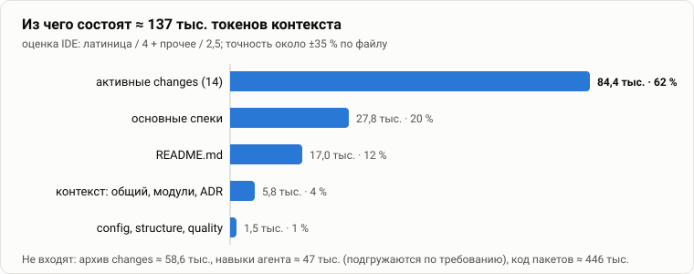

# 01. Архитектурная постановка

[← оглавление](README.md) · дальше: [02 — граф контекста](02-context-graph.md)

## Проблема

Качество работы агента определяется тем, что лежит у него в контексте. На
маленьком проекте это не вопрос: README, все спеки и описание кода
помещаются в окно. На большом — десятки модулей и сервисов, сотни
capabilities, история решений — описание проекта разрастается, и появляются
три проблемы, которые сами по себе не решаются.

1. **Всё не помещается, а «всё» и не нужно.** Положить в окно весь контекст
   дорого, а там, где он и влезает, агент вязнет в нерелевантном: внимание
   размывается, нужное теряется в середине. Задаче «поменять репликацию»
   нужны спека репликации, контекст двух модулей, которые её реализуют, и
   решение о синхронной записи — а не описание UI и биллинга.
2. **Агент сам выбирает, что читать, — неуправляемо.** Поиск по репозиторию
   находит похожее по словам и пропускает неочевидное: модуль, от которого
   зависит изменяемый, ADR, запрещающий очевидное решение, спеку соседнего
   домена. Выбор не воспроизводится: два запуска на одной задаче читают
   разное, и нельзя сказать, *что именно* агент знал.
3. **Контекст гниёт молча.** Его пишут один раз, а код уходит вперёд: пути
   пропадают, модули переименовываются, абзацы копируются из файла в файл,
   остаются заготовки `TODO`. Ошибка в контексте не роняет сборку — она
   незаметно ухудшает каждый следующий запуск агента.

## Масштаб на этом репозитории

| Часть | Файлов | ≈ токенов | Доля |
| --- | --: | --: | --: |
| активные changes (`openspec/changes/*`, 14 шт.) | 80 | 84 400 | 62 % |
| основные спеки (`openspec/specs/`) | 11 | 27 800 | 20 % |
| `README.md` | 1 | 17 000 | 12 % |
| контекст: общий, модули, ADR (`openspec/context/`) | 13 | 5 800 | 4 % |
| `config.yaml`, `structure.yaml`, `quality.yaml` | 3 | 1 500 | 1 % |
| **итого** | **108** | **≈ 136 500** | |

Для сравнения: архив changes — ещё ≈ 58 600, навыки агента в `.claude/` —
≈ 47 000 (загружаются по требованию), код пакетов — ≈ 446 000. Оценка — та же
эвристика, что у IDE (латиница / 4 + прочее / 2,5), точность около ±35 % по
файлу.

Два вывода, которые определяют остальные документы:

- **Сам контекст модулей лёгкий (4 %), тяжелы спеки и changes.** Значит,
  экономия не в том, чтобы писать `context.md` короче, а в том, чтобы
  подшивать *только нужные спеки* — это и делает граф модулей и доменов.
- **62 % объёма — незаархивированные changes.** Change, который сделан, но не
  заархивирован, остаётся в рабочем наборе и дублирует будущий основной спек.
  Вовремя архивировать — самый дешёвый способ сократить контекст
  ([06](06-change-lifecycle.md#архивируй-вовремя)).

## Цель

Сделать контекст **инженерным артефактом** — таким же, как код:
структурированным, адресуемым по частям и проверяемым автоматически.

Отсюда две функции, ради которых создана IDE:

- **Подшивка среза.** Для задачи собирается не весь контекст, а
  детерминированный набор файлов — только то, что относится к затронутым
  модулям и доменам, с их зависимостями и решениями
  ([03](03-slicing.md)).
- **Валидация.** Связи, объём, содержимое и соответствие коду проверяются
  так же, как тесты: в редакторе («Проблемы» VS Code) и в CI
  (`openspec-ide-check`). Сломанный контекст ломает PR
  ([04](04-validation.md)).

Вторая функция — условие первой: срез точен ровно настолько, насколько точны
связи, по которым он собирается.

## Атрибуты качества

| Атрибут | Требование | Чем обеспечено |
| --- | --- | --- |
| **Масштабируемость** | объём набора растёт с размером *затронутой* части, а не всего проекта | срез по графу модулей и доменов, бюджет `max_tokens` на набор |
| **Воспроизводимость** | один и тот же выбор даёт один и тот же набор | чистая функция `contextBundle` в `core` без ввода-вывода (ADR-004) |
| **Проверяемость** | каждая связь и каждый путь проверяются машиной | правила карты и контроля контекста, одни и те же в IDE и CI (ADR-002) |
| **Прозрачность** | видно, что именно агент получил и сколько это стоит | набор строками `@путь`, оценка токенов и полезности у каждого файла |
| **Независимость от агента** | работает с любым агентом в терминале или редакторе | контекст — markdown с frontmatter, IDE агентов не запускает (ADR-006) |
| **Без своей инфраструктуры** | никакой БД, сервиса индексации, ключей API | всё — файлы в git рядом с кодом, источник истины — диск и CLI OpenSpec (ADR-003) |

## Ограничения

- Источник истины — файлы `openspec/` и CLI `@fission-ai/openspec`; IDE не
  хранит своего состояния проекта.
- IDE не вызывает LLM — ни для подбора контекста, ни для проверки. Все
  проверки — детерминированные правила.
- Токенизатора модели нет: объём оценивается эвристикой, поэтому везде «≈».

## Не цели

- **Не автоматический подбор контекста.** Связи задаёт человек; IDE их
  проверяет и подсказывает пробелы, но не дописывает сама.
- **Не точный счёт токенов** — для этого нужен токенизатор конкретной модели.
- **Не запуск агентов и не вызов LLM** (ADR-006).
- **Не документация для людей**: контекст пишется для агента — коротко,
  проверяемо, без пересказа спеков. Для людей — README и этот каталог.

## Решения, на которых держится постановка

| ADR | Решение | Что даёт |
| --- | --- | --- |
| [ADR-003](../../openspec/context/adr/ADR-003-cli-source-of-truth.md) | источник истины — файлы и CLI OpenSpec | контекст живёт в git, ревьюится в PR, повторяется из терминала |
| [ADR-004](../../openspec/context/adr/ADR-004-pure-core.md) | чистый `core` без Node API | сборка набора и правила детерминированы и тестируются без диска |
| [ADR-002](../../openspec/context/adr/ADR-002-embedded-backend.md) | бэкенд в процессе расширения, тот же — в CI | правила IDE и CI совпадают по построению |
| [ADR-006](../../openspec/context/adr/ADR-006-context-not-agents.md) | IDE готовит контекст, а не запускает агентов | инструмент не привязан к агенту |
| [ADR-005](../../openspec/context/adr/ADR-005-agent-in-ide.md) | *(отменено)* запуск агента из IDE | показал: не хватает не запуска, а управляемого контекста |
