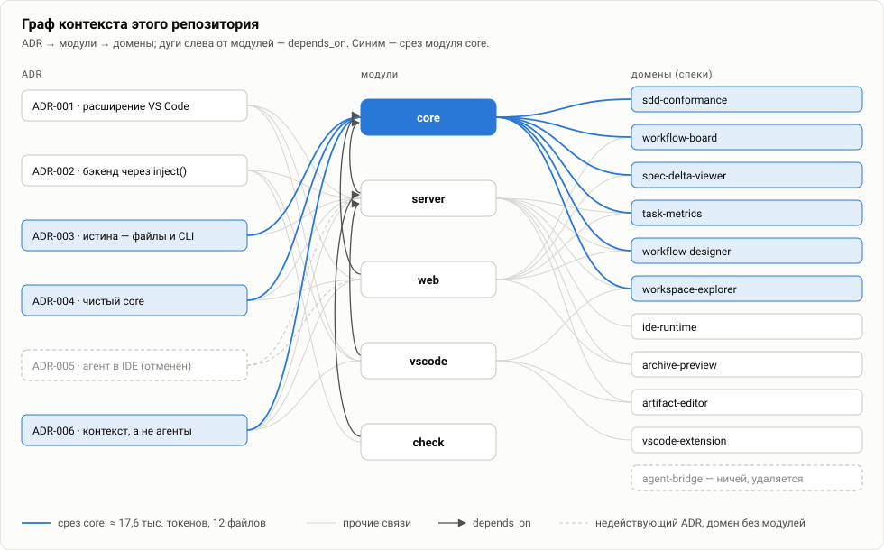
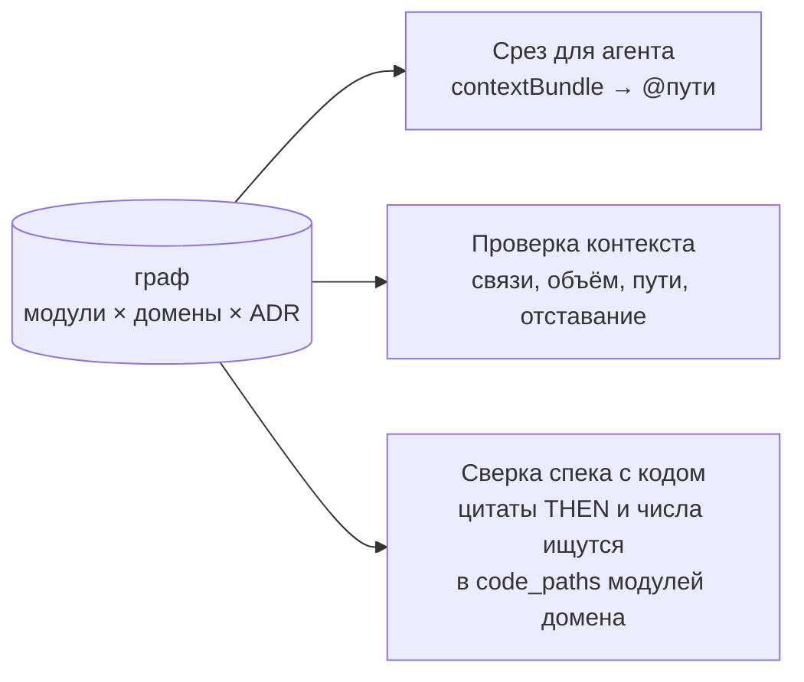
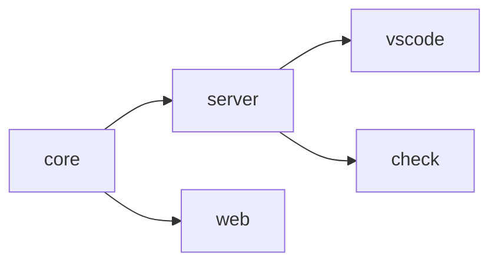

# 02. Контекст как граф: модули × домены × ADR

[← 01 — постановка](01-problem.md) · [оглавление](README.md) · дальше: [03 — срез](03-slicing.md)

## Две оси и два слоя

Контекст раскладывается по двум независимым осям — **домены** и **модули** —
и связывается явными ссылками. Поверх них — решения (ADR) и общий контекст.

| Узел | Что описывает | Файл | Как меняется |
| --- | --- | --- | --- |
| **Домен** (capability) | *что* система должна делать — требования и сценарии | `openspec/specs/<домен>/spec.md` | через changes OpenSpec, медленно |
| **Модуль** | *где и как* это сделано — устройство, контракты, инварианты кода | `openspec/context/modules/<модуль>/context.md` | вместе с кодом |
| **ADR** | *почему* так, а не иначе | `openspec/context/adr/ADR-NNN-*.md` | дописывается, не переписывается |
| **Общий контекст** | что нужно в любой задаче | `openspec/context/NN-*.md` | редко |



Рёбра графа — поля frontmatter:

| Ребро | Поле | Где | Смысл |
| --- | --- | --- | --- |
| модуль → домен | `domains` | `index.md` модуля | код модуля реализует требования этого спека |
| модуль → модуль | `depends_on` | `index.md` модуля | без контекста зависимости нельзя менять модуль |
| модуль → код | `code_paths` | `index.md` модуля | каталоги кода — связь с реальностью |
| ADR → модуль, домен | `modules`, `domains` | frontmatter ADR | решение действует для этих узлов |

Связь модуль ↔ домен — **многие-ко-многим**: модуль перечисляет свои домены,
у домена видны все модули, которые его перечислили.

## Почему две оси, а не одна

Задачи в большом проекте приходят с обеих сторон: «поменять поведение
репликации» (домен) и «переписать хранилище в `sds-master`» (модуль). Одно и
то же поведение реализуют несколько модулей, один модуль обслуживает
несколько доменов. Матрица позволяет войти с любой стороны и автоматически
получить вторую.

| Альтернатива | Почему не подходит |
| --- | --- |
| **Только модули** (описание в каждой папке, вроде `AGENTS.md`) | требование, которое реализуют три модуля, либо копируется в три файла, либо теряется; нет места поведению, которое не принадлежит одному каталогу |
| **Только домены** (одни спеки) | агент знает, *что* сделать, но не знает устройства кода, контрактов и инвариантов |
| **Один большой документ** | нельзя взять часть, нельзя проверить, к какому коду относится абзац |
| **Семантический поиск / RAG** | подбор по похожести не воспроизводится, его нельзя проверить и отревьюить; явные связи пишет человек, их видно в диффе PR |

## Метаданные отдельно от содержимого

Граф описан во frontmatter `index.md` и ADR, а текст для агента — в
`context.md`. `index.md` в набор не входит: связи разбирает машина, токены
агента на них не тратятся. Это же позволяет менять связи, не трогая текст, и
видеть в диффе PR отдельно «поменялась карта» и «поменялось описание».

```yaml
# openspec/context/modules/server/index.md
---
module: server
description: Бэкенд IDE — маршруты /api, обёртка CLI OpenSpec, чтение файлов, git, …
domains: [ide-runtime, workspace-explorer, artifact-editor, archive-preview, task-metrics, workflow-designer]
code_paths: [packages/server]
depends_on: [core]
max_tokens: 30000
---
```

## Один граф — три применения

Граф окупается трижды, и это главный аргумент за то, чтобы его поддерживать.



1. **Срез** — какие файлы дать агенту ([03](03-slicing.md)).
2. **Проверка контекста** — ненайденные домены, циклы, пропавшие пути,
   отставание от кода ([04](04-validation.md)).
3. **Сверка спека с кодом** — **Применяется** (change
   `add-spec-consistency`): для спека домена IDE собирает код из `code_paths`
   его модулей и предупреждает `code-message`, если цитата из шага THEN не
   находится в коде, и `code-constant`, если числовой границы из требования
   нет литералом. Если цитата нашлась в модуле *другого* домена, замечание
   подсказывает этот модуль — то есть связь домена с модулем, вероятно,
   пропущена. Граф проверяет код, а код — граф.

## Матрица этого репозитория

Модули — пакеты монорепозитория, зависимости — по сборке и импортам:



| Модуль | `code_paths` | `depends_on` | `max_tokens` |
| --- | --- | --- | --- |
| `core` | `packages/core` | — | 22000 |
| `server` | `packages/server` | `core` | 30000 |
| `web` | `packages/web` | `core` | 25000 |
| `vscode` | `packages/vscode` | `server` | 36000 |
| `check` | `packages/check` | `server` | 30000 |

| Домен ↓ / модуль → | core | server | web | vscode | check | модулей |
| --- | :-: | :-: | :-: | :-: | :-: | :-: |
| `workflow-board` | ✓ | | ✓ | | | 2 |
| `spec-delta-viewer` | ✓ | | ✓ | | | 2 |
| `task-metrics` | ✓ | ✓ | ✓ | | | 3 |
| `workflow-designer` | ✓ | ✓ | ✓ | | | 3 |
| `workspace-explorer` | ✓ | ✓ | | ✓ | | 3 |
| `sdd-conformance` | ✓ | | | | | 1 |
| `ide-runtime` | | ✓ | | | | 1 |
| `artifact-editor` | | ✓ | | ✓ | | 2 |
| `archive-preview` | | ✓ | ✓ | | | 2 |
| `vscode-extension` | | | | ✓ | | 1 |
| `agent-bridge` | | | | | | 0 — удаляется change `focus-context-map` |

## Правила ведения матрицы

- **Домен без модулей** — сигнал: либо поведение никто не реализует (как
  `agent-bridge` после ADR-006), либо модуль забыл его перечислить. IDE
  показывает предупреждение.
- **Модуль без доменов** (`check`) допустим для инфраструктуры поверх чужого
  поведения: `check` запускает те же проверки, что и IDE.
- **В `domains` — только существующие основные спеки.** Capabilities, которые
  пока живут в дельтах активных changes (`context-map`, `quality-view`,
  `spec-quality`, `spec-consistency`, `change-drift`, `conformance-check`,
  `spec-authoring`, `structure-conformance`, `panel-ui`,
  `change-traceability`), в `domains` не попадают — ссылка на
  несуществующий спек даёт ошибку. Домен добавляется в `index.md` модулей
  при архивации change, который создаёт спек.
- **Домен — по коду, а не по названию.** Модуль перечисляет домен, только
  если его код реализует требования спека. Лишний домен — лишняя спека в
  каждом срезе модуля; пропущенный — агент не узнает о требовании.
- **`depends_on` — «без чего нельзя менять», а не «с кем общается»**
  ([03](03-slicing.md#дисциплина-связей)).
- **Спека больше ~5 тыс. токенов — кандидат на разделение capability.**
  **Идея**: в срезах модулей 81–84 % объёма — спеки доменов
  ([03](03-slicing.md#замер-на-этом-репозитории)); дробная capability
  (`identity/auth`, `identity/sessions`) позволяет модулю перечислить только
  нужную часть.
- **Матрица задаёт форму плана.** Пункты `tasks.md` группируются по модулям в
  порядке зависимостей — «1. Модель (`core`) → 2. Сервер → 3. Интерфейс
  (`web`) → 4. VS Code → 5. Документация». Каждая группа проверяема
  отдельно и получает свой срез — это основа разделения работы между
  агентами ([08](08-multi-agent.md)).

## Идеи развития графа

- **Владельцы узлов** — **Идея**: поле `owners` в `index.md` и ADR. Даёт
  автоматический выбор ревьюера PR по затронутым `code_paths` и адресата
  замечания «контекст отстаёт от кода».
- **Ребро «модуль → внешний контракт»** — **Идея**: для больших систем
  полезно отдельно указывать публикуемые API (OpenAPI, protobuf, схемы
  событий), чтобы срез модуля-потребителя брал контракт, а не весь контекст
  модуля-поставщика.
- **Уровни детализации контекста** — **Идея**: `context.md` (кратко, для
  зависимых модулей) и `context-deep.md` (подробно, только когда модуль
  меняется сам). Транзитивные зависимости получали бы краткую версию.
  Потребует правки IDE и `structure.yaml`: сейчас любой третий файл в папке
  модуля — замечание «не входит ни в один набор».
