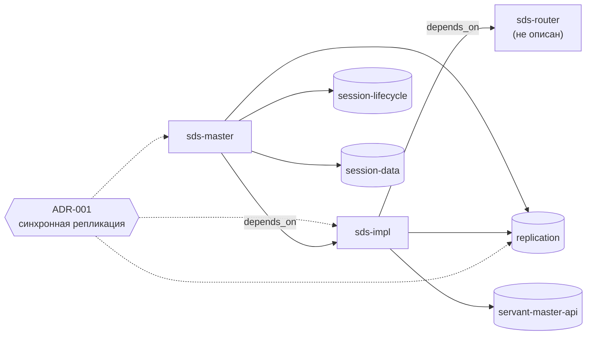

# 03. Срез контекста

[← 02 — граф](02-context-graph.md) · [оглавление](README.md) · дальше: [04 — проверки](04-validation.md)

## Алгоритм

Пользователь выбирает узлы: модули `M`, домены `D`, ADR `A`. Набор —
функция `contextBundle` в `packages/core/src/contextMap.ts`:

```
M*    = M ∪ транзитивное замыкание M по depends_on
набор = общий контекст
      ∪ context.md каждого модуля из M*
      ∪ спеки доменов модулей M* ∪ спеки D
      ∪ действующие ADR, ссылающиеся на модули M* или домены D
      ∪ A (явно выбранные — даже недействующие)
```


- Порядок загрузки фиксирован: общий контекст → модули → спеки → ADR; каждый
  файл входит один раз; циклы и неописанные модули не ломают обход.
- Флажками отключаются зависимости и спеки доменов модулей — тогда в наборе
  только явно выбранное.
- Недействующие ADR (`superseded`, `deprecated`…) не входят: история решений
  не должна спорить с действующими.
- Результат — строки `@путь`, в таком виде их принимают агенты в терминале, —
  с оценкой токенов и долей полезных.
- Функция чистая (ADR-004): один и тот же выбор даёт один и тот же набор.
  Это и есть воспроизводимость — можно записать в отчёт, *что* знал агент.

## Пример

Фикстура [`tests/fixtures/context-map`](../../tests/fixtures/context-map/)
моделирует распределённое хранилище сессий:



Сплошные стрелки к доменам — `domains`, подписанные — `depends_on`,
пунктир — привязка ADR. Пятая спека фикстуры, `cm-cluster-api`, не
относится ни к одному модулю и на схеме не показана.

| Выбор | Что попадёт в набор | Что не попадёт |
| --- | --- | --- |
| домен `replication` | общий контекст, спека `replication`, ADR-001 | контекст модулей, остальные спеки |
| модуль `sds-impl` | общий контекст, `context.md` `sds-impl`, спеки `replication` и `servant-master-api`, ADR-001 | `sds-master` и его домены `session-*`, спека `cm-cluster-api` |
| модуль `sds-master` | то же плюс `context.md` `sds-master`, спеки `session-lifecycle` и `session-data` | спека `cm-cluster-api` |

Зависимость направлена в одну сторону: чтобы менять `sds-master`, нужны
контракты `sds-impl`, а чтобы менять `sds-impl`, контекст `sds-master` не
нужен — что сломается у зависимых, ловят тесты и проверки.

## Замер на этом репозитории


Посчитано по той же формуле и той же оценке токенов, что у IDE:

| Срез | Модули в наборе | Файлов | `context.md` | Спеки | ADR | ≈ Всего | `max_tokens` | Доля от 136,5 тыс. |
| --- | --- | --: | --: | --: | --: | --: | --: | --: |
| модуль `core` | core | 12 | 800 | 14 700 | 800 | **17 600** | 22 000 | 13 % |
| модуль `web` | web, core | 15 | 1 200 | 16 300 | 1 200 | **20 000** | 25 000 | 15 % |
| модуль `server` | server, core | 18 | 1 500 | 20 300 | 1 500 | **24 700** | 30 000 | 18 % |
| модуль `check` | check, server, core | 19 | 1 900 | 20 300 | 1 500 | **25 000** | 30 000 | 18 % |
| модуль `vscode` | vscode, server, core | 20 | 2 000 | 24 400 | 1 500 | **29 200** | 36 000 | 21 % |
| домен `ide-runtime` | — | 5 | — | 2 000 | 600 | **3 900** | — | 3 % |
| домен `workflow-board` | — | 3 | — | 3 600 | — | **4 800** | — | 4 % |
| домен `vscode-extension` | — | 5 | — | 4 000 | 700 | **6 000** | — | 4 % |

В каждый срез входит общий контекст (≈ 1 300).

Что видно из замера:

- **Срез модуля в 5–8 раз меньше всего контекста, срез домена — в 23–35
  раз.** Для задачи на одну capability агенту хватает 4–6 тыс. токенов.
- **Спеки — 81–84 % среза модуля.** `context.md` лёгкий; рост среза
  определяют домены модулей. Отсюда два рычага: узкие `domains` и
  дробные capabilities ([02](02-context-graph.md#правила-ведения-матрицы)).
- **Все срезы укладываются в бюджет с запасом 20–25 %** — так бюджеты и
  задавались: текущий объём плюс ~25 %.
- **Активные changes в срез модуля не входят** — их 84 тыс. токенов
  подшиваются только адресно (proposal, design, tasks и дельта *своего*
  change).

## Дисциплина связей

Срез маленький, только пока связи узкие.

- **`depends_on` — «без чего нельзя менять», а не «с кем общается».** Модуль,
  который вызывает пять сервисов, зависит по контексту только от тех, чьи
  контракты нужно знать при правке. Иначе транзитивное замыкание быстро
  становится всем проектом.
- **`domains` — то, что код модуля действительно реализует.**
- **Бюджет — контракт.** Набор сверх `max_tokens` — предупреждение. Первая
  реакция — убрать повторы, пересказ спеков и лишние связи (навык
  `context-fill`, промпт 5), и только потом поднимать бюджет.

## Паттерны использования среза

| Паттерн | Как | Статус |
| --- | --- | --- |
| **Срез на задачу** | перед запуском агента — набор из карточки модуля или панели «Набор контекста», строки `@путь` в промпт | Применяется |
| **Срез на группу плана** | каждая группа `tasks.md` (модель, сервер, интерфейс…) — свой модуль и свой срез; агент не держит в голове весь change | Применяется (группы по модулям), запуск по группам — практика |
| **Срез по домену для вопросов** | «как устроено X» — срез домена: спека + ADR, 4–6 тыс. | Применяется |
| **Срез + дифф для ревьюера** | ревьюер получает спеки затронутых доменов, ADR и дифф, но не переписку исполнителя ([08](08-multi-agent.md#ревьюер-со-свежим-срезом)) | Идея |
| **Change + срез** | proposal, design, tasks, дельта своего change + срез затронутых модулей — вместо всех активных changes | Применяется |
| **Стабильное — первым** | порядок «общий → модули → спеки → ADR» ставит редко меняющиеся файлы в начало; при кэшировании промпта у провайдера модели общий префикс переиспользуется между запусками | Идея (порядок уже такой; эффект кэша не замерялся) |
| **Срез в отчёте** | агент пишет в отчёт список `@путей`, с которыми работал; воспроизводимо и проверяемо на ревью | Идея |
