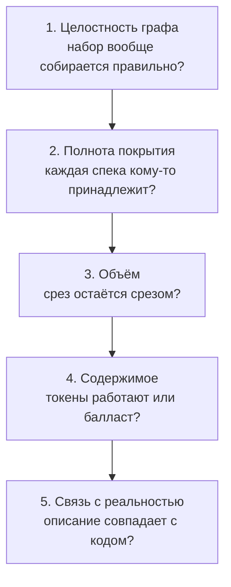
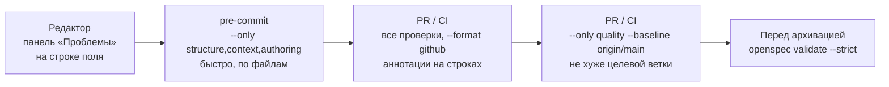

# 04. Проверка контекста

[← 03 — срез](03-slicing.md) · [оглавление](README.md) · дальше: [05 — структура файлов](05-file-structure.md)

## Громкие и тихие ошибки

Граф контекста ошибается двумя способами: **громко** (набор не собирается) и
**тихо** (набор собирается, но без нужного файла или с мусором). Тихие
ошибки опаснее — агент работает с неполной картиной, и этого никто не видит.
Поэтому проверки разбиты на уровни по тому, что они защищают.



| Уровень | Что ловит | Почему это важно для среза | Уровень замечания |
| --- | --- | --- | --- |
| **1. Целостность графа** | домен из `domains` не найден; модуль из `depends_on` или ADR не описан; цикл и зависимость от себя; два модуля с одним `module`; нет `index.md` или frontmatter не разбирается | набор молча теряет спеку или модуль | ошибка |
| **2. Полнота покрытия** | домен не относится ни к одному модулю; нет `context.md`; путь из `code_paths` не найден | спеку никто не подошьёт; модуль без описания; связь с кодом разорвана | предупреждение |
| **3. Объём** | файл больше 8000 токенов; набор модуля больше `max_tokens` | срез перестаёт быть срезом | предупреждение |
| **4. Содержимое** | абзацы-повторы между файлами; пустой `context.md`; файл в `openspec/context/`, не входящий ни в один набор; коэффициент полезности ниже 50 %; антипаттерны: большие блоки кода, base64, псевдографика, HTML, «вода», капс | токены тратятся на балласт; файл вне наборов агент не увидит никогда | предупреждение / сведение |
| **5. Связь с реальностью** | путь из текста не найден; контекст модуля отстаёт от кода на N коммитов; модуль без `code_paths`; цитата THEN или число из требования не найдены в коде модулей домена | описание расходится с кодом | предупреждение / сведение |

В фикстуре `context-map`: `sds-router` в `depends_on` не описан — ошибка;
спека `cm-cluster-api` не относится ни к одному модулю — предупреждение;
каталог `sds-impl/src` не найден — предупреждение.

## Полезность и антипаттерны — не «длина», а «цена смысла»

```
полезность = плотность × (0,5 + 0,5 × привязка) × свежесть
```

- **плотность** — доля токенов без балласта (повторы, заготовки, абзацы со
  ссылкой на ненайденный путь);
- **привязка** — доля текста `context.md` в абзацах с `` `кодом` `` или
  ссылкой: контекст, привязанный к коду, проверяем;
- **свежесть** — 1 / (1 + N / 10), где N — коммиты в коде модуля после правки
  контекста.

Антипаттерны считают, сколько токенов можно сэкономить, не теряя смысла:
листинг кода вместо ссылки на файл и строки, base64 и хеши, рамки
псевдографики, HTML вместо markdown, вводные фразы, капс. Формулы и замеры —
в design changes `add-context-usefulness` и `add-context-antipatterns`.

## Ворота: где ловится ошибка



| Ворота | Команда | Что даёт |
| --- | --- | --- |
| редактор | расширение VS Code | замечание видно в момент правки, на строке поля |
| pre-commit | `openspec-ide-check --only structure,context,authoring` | быстрые проверки по файлам, без git-истории |
| CI на PR | `openspec-ide-check --format github` | все проверки, аннотации на строках PR |
| регресс | `openspec-ide-check --only quality --baseline origin/<base>` | метрики качества спеков и число замечаний не хуже целевой ветки |
| архивация | `openspec validate <change> --strict` | формат дельт и спеков по CLI |
| этот репозиторий | `npm run check:openspec` | то же, что CI |

Все ворота вызывают одни и те же функции `core` через встроенный бэкенд
(ADR-002, ADR-004): замечание в редакторе, в разделе и в CI — одно и то же,
с одним файлом и одной строкой.

## Принципы

- **Правило, которое можно проверить, проверяется.** Договорённость из
  `config.yaml`, которую агент может прочитать и забыть, переносится в
  `quality.yaml` как машинная проверка. Пример — **Применяется**:
  «решение в design сопровождается альтернативой» → правило
  `design-alternative`, «у пункта плана есть метрика приёмки» → правило
  `task-acceptance`.
- **Детерминированные правила, а не LLM-судья.** Проверка не зависит от
  модели, не стоит токенов, одинакова в IDE и CI и не «передумывает».
  Оценку смысла оставляют человеку на ревью.
- **Сведение — не ошибка.** Отставание от кода, низкая полезность,
  антипаттерны — подсказки человеку. Порог CI по умолчанию —
  `--fail-on error`; ужесточать по мере зрелости ([10](10-adoption.md)).
- **Честные оценки.** Токены и экономия — со знаком ≈; формулы и калибровка —
  в design changes.
- **Замечание всегда несёт файл и строку (с 1).** Иначе его не исправит ни
  человек, ни агент.

## Связанные проверки вокруг контекста

| Проверка | Что ловит | Статус |
| --- | --- | --- |
| `coverage` | сценарий ADDED/MODIFIED, на который не ссылается ни один пункт плана | Применяется |
| `authoring` | ссылки дельт на основной спек и ссылки `↳` плана | Применяется |
| `plan-test-ref` | пункт плана ссылается на несуществующий файл теста или переименованный тест | Применяется (`add-spec-consistency`) |
| `drift` | два активных change меняют одно требование; дельта устарела относительно основного спека | Применяется (`add-change-drift`) |
| `structure` | раскладка папок по `structure.yaml` | Применяется |

## Идеи

- **Порог полезности в CI** — **Идея**: `--fail-on info` только для
  `context` на ветке main, чтобы новые сведения о балласте не копились.
- **Отставание как задача** — **Идея**: контекст модуля, отставший больше
  чем на K коммитов, создаёт пункт в плане ближайшего change, затрагивающего
  модуль.
- **Проверка ADR на упоминание** — **Идея**: design.md с решением, помеченным
  как архитектурное, без ADR со ссылкой на этот change — сведение
  ([09](09-adr.md#идеи)).
