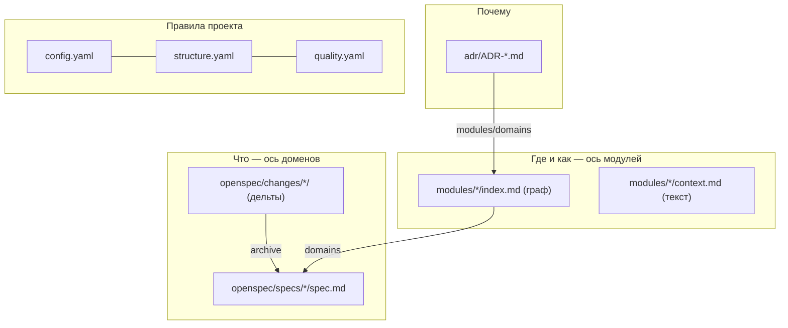

# 05. Структура файлов

[← 04 — проверки](04-validation.md) · [оглавление](README.md) · дальше: [06 — цикл change](06-change-lifecycle.md)

## Раскладка

```
openspec/
  config.yaml                 схема spec-driven, контекст проекта для CLI, rules по артефактам
  structure.yaml              разрешённая раскладка папок (проверяется IDE и CI)
  quality.yaml                исполняемые правила качества, пороги, исключения
  specs/
    <домен>/spec.md           основные спеки — ось «домены»
  changes/
    <глагол>-<что>/           активный change
      .openspec.yaml          schema, created
      proposal.md             Why / What Changes / Не входит / Capabilities / Impact
      design.md               Context / Decisions (решение + альтернатива) / замер
      tasks.md                группы по модулям, пункты с проверкой и ↳-ссылками
      specs/<домен>/spec.md   дельта: ADDED / MODIFIED / REMOVED / RENAMED Requirements
    archive/
      YYYY-MM-DD-<имя>/       заархивированные changes
  context/
    01-project.md             общий контекст: продукт, источник истины, устройство, термины
    02-conventions.md         договорённости: язык, процесс, код, проверка
    modules/<модуль>/         ось «модули»
      index.md                только frontmatter — узел и рёбра графа
      context.md              текст для агента
    adr/
      ADR-NNN-<slug>.md       решения с привязкой к модулям и доменам
docs/
  mockups/*.html              HTML-макеты интерфейса до change
  patterns/                   этот каталог
.claude/skills/, .claude/commands/opsx/
                              навыки и команды OpenSpec для Claude Code
.agents/skills/               те же навыки для других агентов (отличаются только
                              именами команд: /openspec-* вместо /opsx:*)
tests/fixtures/<сценарий>/openspec/
                              фикстурные OpenSpec-проекты для тестов и e2e
```



## Что где писать

| Вопрос | Файл | Чего там быть не должно |
| --- | --- | --- |
| что система должна делать | `specs/<домен>/spec.md` | устройства кода, причин решений |
| что меняем и зачем | `changes/<имя>/proposal.md` | деталей реализации |
| как и почему именно так | `changes/<имя>/design.md` | требований (они в дельте) |
| шаги и как проверить каждый | `changes/<имя>/tasks.md` | рассуждений |
| как устроен модуль | `context/modules/<м>/context.md` | пересказа спеков, листингов кода |
| почему так решили навсегда | `context/adr/ADR-*.md` | подробностей (они в design.md) |
| что нужно в любой задаче | `context/NN-*.md` | описания отдельных модулей |
| какие правила проверять | `quality.yaml`, `structure.yaml` | — |

## Именование

- **Change** — kebab-case с глаголом-префиксом: `add-*` (новая
  возможность), `fix-*` (исправление), `rework-*` / `redesign-*`
  (переделка), `validate-*`, `focus-*` (сужение/замена).
- **Архив** — `YYYY-MM-DD-<имя>`; связанные changes архивируются пачкой.
- **Домен** — kebab-case, путь может быть вложенным (`identity/auth`). Имя в
  `Capabilities` proposal — точный путь спека.
- **Общий контекст** — `NN-тема.md`: номер задаёт порядок в наборе.
- **ADR** — `ADR-NNN-<slug>.md`, номера не переиспользуются.
- **Макет** — `docs/mockups/<тема>.html`, ссылка на него — в proposal и design.

## Форма артефактов

**proposal.md** — `## Why` (проблема, ссылка на макет), `## What Changes`
(жирные заголовки пунктов), явное «Не входит: …», `## Capabilities` с New /
Modified и точными путями, `## Impact` — код (файлы и функции), API
(маршруты, `API_REVISION`), файлы проекта.

**Дельта спека** — `### Requirement:` с нормативом «ДОЛЖЕН/ДОЛЖНА (SHALL)»,
минимум один `#### Scenario:` с **WHEN**/**THEN** на конкретных данных
фикстур:

```markdown
#### Scenario: Файлы по убыванию предупреждений

- **WHEN** у дельты `data-export` одно предупреждение `vague-wording`, и пользователь открывает раздел «Качество»
- **THEN** в таблице файлов есть строка `data-export` с одним предупреждением
```

**design.md** — `## Context` со ссылками («Мотивация — в `proposal.md`,
требования — в дельте `specs/<домен>`, макеты — …, строится поверх
`<change>`»), `## Decisions` — `### N. <решение>` с абзацами **Решение.** и
**Альтернатива — …**, для эвристик — «Замер на этом репозитории».

**tasks.md** — группы по модулям, пункт с проверкой и ссылками на сценарии:

```markdown
## 1. Модель

- [x] 1.1 Исключения: `exclude` в `parseQualityConfig`, `pathMatches`, `applyExclusions`; проверка — тесты «исключения правил» в `packages/core/src/qualityOverview.test.ts`
  ↳ quality-view / Правило в требовании
  ↳ quality-view / Старые спеки исключены целиком
```

**index.md модуля** — только frontmatter: `module`, `description`,
`domains`, `code_paths`, `depends_on`, `max_tokens`.

**context.md модуля** — разделы, пустые пропускаются: назначение и границы;
устройство (таблица «файл — что делает»); контракты; инварианты и чем они
проверяются; как менять; подводные камни. Ориентир — 600–2000 токенов.

**ADR** — frontmatter `status`, `date`, `modules`, `domains`; разделы
Контекст / Решение / Рассмотренная альтернатива / Последствия; 200–600
токенов ([09](09-adr.md)).

## Раскладка закреплена и проверяется

`openspec/structure.yaml` описывает раскладку деревом: `file` — обязательный
файл, `"*"` — свободная папка, `?` — необязательный элемент, шаблоны имён.
Лишний файл в строгой папке, пропавший обязательный, не тот тип — замечание
с номером строки правила. Описание этого репозитория —
[`openspec/structure.yaml`](../../openspec/structure.yaml).
