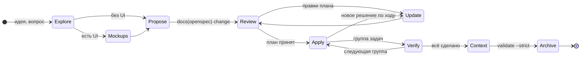
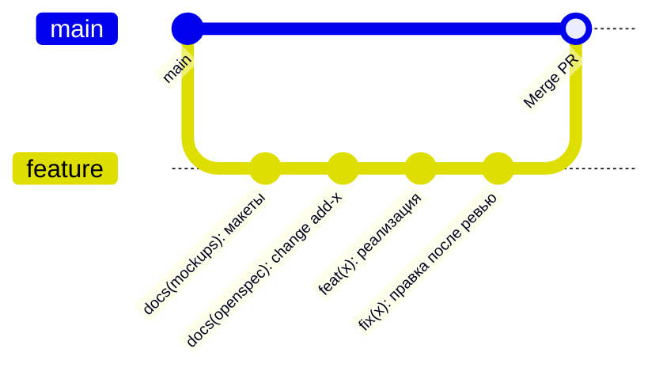
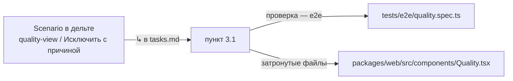
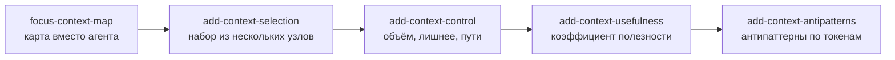

# 06. Жизненный цикл change

[← 05 — структура](05-file-structure.md) · [оглавление](README.md) · дальше: [07 — паттерны ИИ](07-ai-patterns.md)

## Цикл

| Шаг | Команда | Что получается | Коммит |
| --- | --- | --- | --- |
| **Explore** | `/opsx:explore` | обсуждение без кода; артефакты — только после явного подтверждения объёма | — |
| **Макеты** | — | `docs/mockups/<тема>.html` — общая картинка для человека и агента | `docs(mockups): …` |
| **Propose** | `/opsx:propose` | proposal, дельты, design, tasks за один шаг | `docs(openspec): change <имя>` |
| **Ревью плана** | человек | правки до кода — самое дешёвое место исправить ошибку | — |
| **Update** | `/opsx:update` | новое решение сначала в артефакты, согласованно между ними; код не трогается | `docs(openspec): …` |
| **Apply** | `/opsx:apply` | реализация по группам `tasks.md`; после группы — `npm run verify` | `feat(<scope>): …` |
| **Контекст** | навык `context-fill` | `context.md` затронутых модулей, ADR, README — последний пункт плана | в том же PR |
| **Archive** | `/opsx:archive` | дельты сливаются в основные спеки; новые домены — в `domains` модулей | `docs(openspec): архивировать …` |

## Порядок коммитов в PR

История этого репозитория показывает устойчивый порядок:

- Ревью плана — это ревью коммита `docs(openspec)`: он маленький и читается
  без кода.
- `feat` можно сравнить с планом построчно: каждый пункт `tasks.md` назвал
  файл, функцию и тест.
- Одна ветка — один change или серия связанных changes.

## Трассировка: сценарий → пункт → тест

- Строка `↳ <capability> / <сценарий>` под пунктом плана связывает его со
  сценарием. Вкладка «Трассировка» показывает процент покрытия; сценарий без
  пункта — пробел: его может не оказаться в коде.
- Проверка `coverage` в CI — предупреждение на непокрытый сценарий.
- Проверка `plan-test-ref` — предупреждение, если пункт ссылается на
  несуществующий файл теста или на тест, который переименовали.
- Для пробела: «Добавить пункт в план» и «Копировать задачу для агента»
  (сценарий с шагами и `@файл` спека и плана).

## Серии changes

Крупную возможность режут на серию changes, каждый строится поверх
предыдущего, ещё не заархивированного:

- Все пять — `ADDED Requirements` в одну capability `context-map`.
- В `design.md` — строка «Строится поверх `<change>`».
- Каждый change маленький: свой PR, свой ревью плана, свой замер.
- Риск серии — пересечения дельт. Их показывает раздел «Пересечения»
  (проверка `drift`): два change меняют одно требование, или MODIFIED
  описывает уже не существующую версию требования.

## Архивируй вовремя

Сейчас в репозитории 14 активных changes, ≈ 84 тыс. токенов — 62 % всего
контекста ([01](01-problem.md#масштаб-на-этом-репозитории)). Сделанный, но не
заархивированный change:

- держит требования вне основных спеков — срез модуля их не видит;
- дублирует будущий основной спек и раздувает рабочий набор;
- копит пересечения с новыми changes.

Правила:

- **Change «Готово к архивации» не живёт дольше нескольких дней.** IDE
  помечает «ждёт архивации N дн.» после 3 дней без активности.
- **Серию архивируют пачкой** командой «OpenSpec: Архивировать готовые
  changes…»: по одному в порядке создания, каждому предшествует предпросмотр.
- **После архивации — граф**: новые capabilities добавляются в `domains`
  модулей, иначе останутся «доменом без модулей».

## Ещё паттерны процесса

| Паттерн | Суть | Статус |
| --- | --- | --- |
| **Макет до спеки** | HTML-макет — одна картинка для человека, агента и спеки; спека описывает видимое на макете | Применяется (`docs/mockups/`) |
| **Явное «Не входит»** | в proposal перечислено, что *не* делается; защищает от расползания объёма у агента | Применяется |
| **Пункт = файл + функция + тест** | пункт плана называет, где и чем проверить; агент не угадывает, ревьюер сверяет | Применяется |
| **Последняя группа — документация** | README, контекст модулей, `verify`, `test:e2e`, `validate --strict` | Применяется |
| **Ревизия контракта** | новое поле или маршрут поднимает `API_REVISION`; панель честно говорит «перезагрузите окно» | Применяется |
| **Change на исправление контекста** | крупная чистка контекста — тоже change с proposal и замером до/после | Идея |
