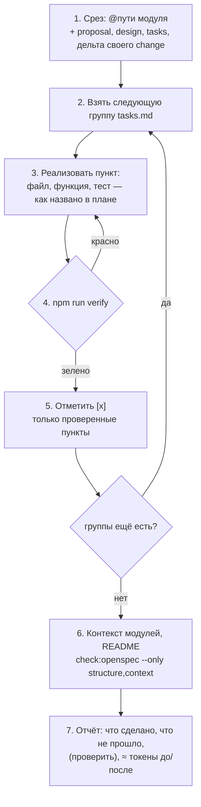

# 07. Паттерны работы с ИИ-агентом

[← 06 — цикл change](06-change-lifecycle.md) · [оглавление](README.md) · дальше: [08 — мультиагентная разработка](08-multi-agent.md)

Каталог для работы с одним агентом. Мультиагентные паттерны — в
[08](08-multi-agent.md), ADR — в [09](09-adr.md).

## Рабочий цикл агента

## A. Планирование

**A1. Спека раньше кода** — Применяется.
Каждая заметная возможность начинается с change, и коммит
`docs(openspec): change <имя>` идёт *до* кода. Агент работает от
требований и сценариев, а не от пересказа задачи в чате; человек ревьюит
маленький план вместо большого диффа.

**A2. Ревью плана дешевле ревью кода** — Применяется.
Главная точка вмешательства человека — proposal и design. Ошибка в
требовании, найденная до кода, стоит одну правку; после — переписанный
модуль и тесты.

**A3. Макет до спеки** — Применяется.
Для UI сначала `docs/mockups/<тема>.html`. Макет снимает неоднозначность
слов («плитки метрик», «карточка правила») для человека и агента сразу.

**A4. Явное «Не входит»** — Применяется.
Proposal перечисляет, чего change *не* делает. Агенты склонны «доделать
заодно»; граница объёма, записанная в артефакт, это пресекает.

**A5. Альтернатива в каждом решении** — Применяется (правило
`design-alternative`).
Решение без отвергнутой альтернативы агент следующей сессии переиграет:
он не знает, что очевидный вариант уже рассматривали. «Альтернатива — …» —
память о том, *почему не*.

**A6. Explore без записи** — Применяется (`/opsx:explore`).
Режим размышления, в котором агент не пишет код и не трогает файлы без
явного подтверждения. Отделяет «подумать» от «сделать».

## B. Исполнение

**B1. Пункт плана — проверяемый шаг** — Применяется (правило
`task-acceptance`).
Формат `N.M <что>; проверка — <тест/e2e/команда>`. Агент знает, когда пункт
закончен; ревьюер — как это проверить.

**B2. Группы по модулям в порядке зависимостей** — Применяется.
«Модель → Сервер → Интерфейс → VS Code → Документация». Каждая группа —
законченный проверяемый шаг со своим срезом; удобная точка остановки и
передачи работы.

**B3. Цикл самопроверки** — Применяется (`operations.apply.guidance`).
После каждой группы — `npm run verify`; `[x]` ставится только после зелёной
проверки. Агент запускает проверки сам, а не оставляет человеку.

**B4. Сценарии на данных фикстур** — Применяется.
WHEN/THEN пишутся на конкретных данных из `tests/fixtures/`
(«у дельты `data-export` одно предупреждение `vague-wording`»). Такой
сценарий почти механически превращается в тест.

**B5. Правило — функция с тестом рядом** — Применяется (`core`,
ADR-004).
Логика — чистыми функциями без ввода-вывода, тест — `*.test.ts` рядом. Агент
проверяет свою правку за секунды, без поднятия окружения.

**B6. Точные имена из кода** — Применяется (навык `context-fill`).
Перед тем как написать имя функции, маршрута или настройки — найти его
поиском. Выдуманное имя в контексте или плане — ложный след для следующего
агента.

## C. Контекст

**C1. Срез вместо репозитория** — Применяется.
Агенту — набор `@путей` модуля или узлов матрицы, а не «посмотри сам»
([03](03-slicing.md)).

**C2. Файлы — память между сессиями** — Применяется.
PR этого репозитория делались сессиями агента на ветках `claude/*`, и каждая
новая сессия начиналась «с нуля». Всё, что должно пережить сессию, — в `openspec/`:
план, решения, отмеченные пункты, контекст модулей. Чат — не хранилище.

**C3. Контекст — часть Definition of Done** — Применяется.
Последний пункт плана — «контекст модулей …, README». Change, после которого
контекст отстал от кода, не закончен.

**C4. Навык как переиспользуемый промпт** — Применяется.
`.claude/skills/context-fill/SKILL.md` — общие правила и пять промптов;
`/opsx:*` — команды цикла change. Копия в `.agents/skills/` — для других
агентов. Хороший промпт пишется один раз и ревьюится, как код.

**C5. Честность вместо уверенного тона** — Применяется.
Неизвестное — «(проверить)» с тем, что проверить; оценки — со знаком ≈ и
границами точности. Агент, который помечает сомнения, экономит время ревью.

**C6. Без заготовок** — Применяется (полезность, антипаттерны).
`TODO`, `<описание>`, HTML-комментарии шаблона в контексте — балласт: IDE
снижает коэффициент полезности. Лучше пустой раздел пропустить.

## D. Контроль

**D1. Детерминированные проверки, а не LLM-судья** — Применяется.
Все проверки IDE — правила без модели: одинаковы в редакторе и CI, ничего
не стоят и не «передумывают».

**D2. Исполняемые договорённости** — Применяется.
Правило из `config.yaml` переносится в `quality.yaml`, где оно проверяется
([04](04-validation.md#принципы)).

**D3. Замер на своём репозитории** — Применяется.
Каждая эвристика (токены, полезность, антипаттерны, качество спеков)
прогоняется на самом проекте, и числа записываются в design.md. Это
калибровка, а не украшение.

**D4. Отчёт агента** — Применяется.
Что сделано, что не прошло (с выводом), объём контекста до и после, список
«(проверить)». Отчёт — вход для ревью и для следующей сессии.

## E. Идеи для развития

| Идея | Суть | Что даёт |
| --- | --- | --- |
| **Тонкий `CLAUDE.md` / `AGENTS.md`-маршрутизатор** | корневой файл агента — 20–40 строк: где общий контекст, как получить срез, какие команды проверки; без описания модулей | агент сам знает, где брать контекст, а корневой файл не раздувается |
| **Хуки на проверки** | хук окончания работы агента запускает `check:openspec --only structure,context`; хук старта сессии ставит зависимости | самопроверка не зависит от памяти агента |
| **Регрессионные задачи для контекста** | 5–10 эталонных вопросов к срезу («какой модуль отвечает за X», «почему не Y») с ожидаемыми ответами; прогон после крупной правки контекста | видно, что сжатие контекста не потеряло смысл |
| **Шаблон «задача для агента»** | issue с полями: change, группа плана, срез (`@пути`), критерий готовности, команды проверки | задача ставится одинаково для любого агента и человека |
| **Бюджет по типу задачи** | вопрос — срез домена (≤ 6 тыс.), правка модуля — срез модуля (≤ `max_tokens`), сквозная фича — несколько срезов по группам | понятно, сколько контекста «нормально» |
| **Срез в отчёте** | агент перечисляет `@пути`, с которыми работал | воспроизводимость и аудит |
