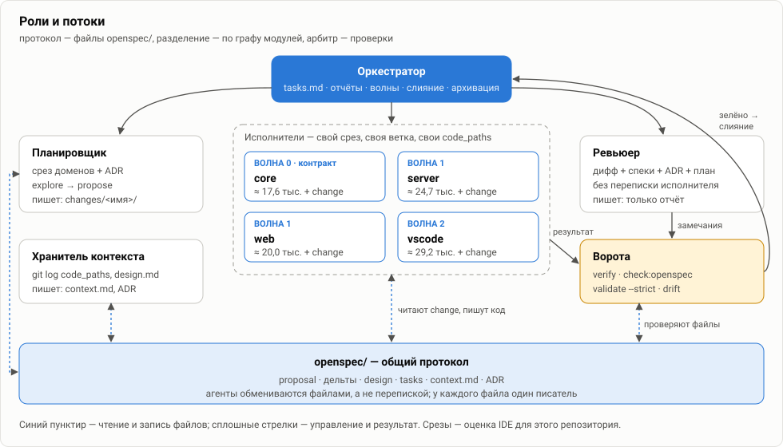
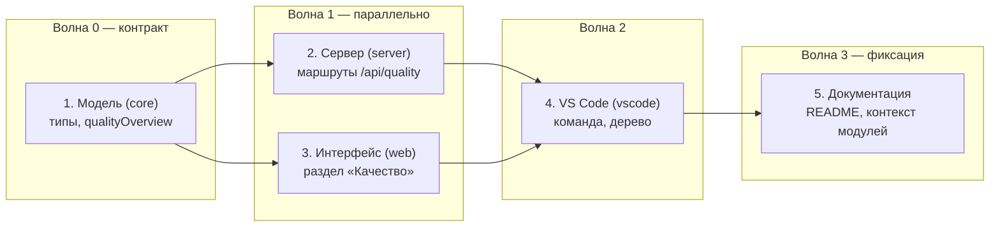
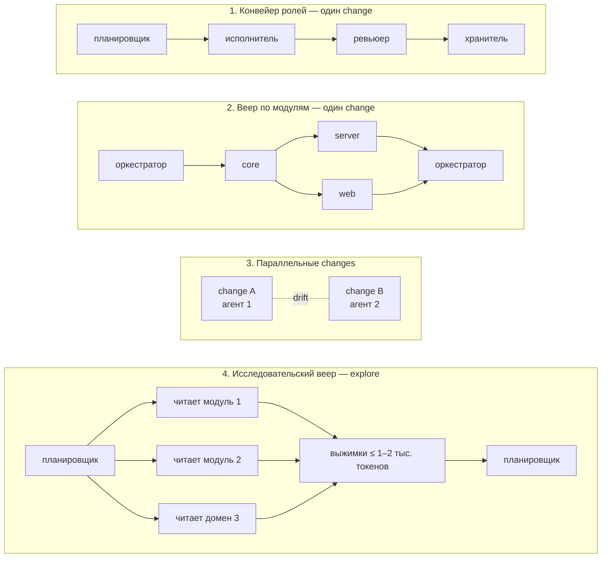

# 08. Мультиагентная разработка

[← 07 — паттерны ИИ](07-ai-patterns.md) · [оглавление](README.md) · дальше: [09 — ADR](09-adr.md)

OpenSpec и граф контекста дают мультиагентной разработке три вещи, которых
ей обычно не хватает:

| Чего не хватает нескольким агентам | Что даёт OpenSpec IDE |
| --- | --- |
| общего языка и договора о том, что делаем | **артефакты change** — proposal, дельты, design, tasks как контракт |
| способа поделить работу без конфликтов | **граф** — модули с `code_paths`, группы плана по модулям, `depends_on` как порядок |
| арбитра, который решает, что сделано | **детерминированные проверки** — verify, `check:openspec`, `validate --strict`, drift |

## Три принципа

1. **Протокол — файлы, а не чат.** Агенты не пересказывают друг другу
   задачу: каждый читает proposal, дельту, design и свою группу `tasks.md` и
   пишет результат в файлы и отчёт. Переписка одного агента другому не
   передаётся — передаются артефакты.
2. **Работа делится по графу, а не «кто свободен».** Модуль — зона записи
   одного агента (`code_paths`), группа плана — единица работы, `depends_on`
   — порядок волн.
3. **Арбитр — проверки, а не согласие агентов.** Готово то, что прошло
   `verify` и `check:openspec`; спор двух агентов решает тест, сценарий или
   ADR, а не третий агент.

## Роли



| Роль | Получает (срез) | Отдаёт | Пишет только в | Статус |
| --- | --- | --- | --- | --- |
| **Планировщик** | общий контекст, срезы затронутых доменов, действующие ADR | change: proposal, дельты, design, tasks | `openspec/changes/<имя>/`, `docs/mockups/` | Применяется (одна сессия: explore → propose) |
| **Исполнитель модуля** | срез своего модуля + артефакты change + своя группа плана | код и тесты, отчёт | `code_paths` своего модуля и его тесты | Идея (сейчас — одна сессия на change) |
| **Ревьюер** | дифф + спеки затронутых доменов + ADR, **без** переписки исполнителя | замечания со ссылкой на сценарий, ADR или правило | ничего, кроме отчёта | Идея |
| **Хранитель контекста** | `git log` по `code_paths` после последней правки `context.md`, design.md changes | `context.md`, ADR, `index.md` | `openspec/context/` | Применяется как шаг (навык `context-fill`), отдельная роль — идея |
| **Оркестратор** | `tasks.md`, отчёты, результаты проверок | порядок волн, отметки `[x]`, слияние, архивация | `tasks.md`, общий контекст, README, `API_REVISION` | Идея |

Права на запись — главное средство от конфликтов: **у каждого файла один
писатель**. Общие точки (`tasks.md`, общий контекст, README, константа
`API_REVISION`) правит только оркестратор.

## Волны из графа

Группы плана идут по модулям в порядке зависимостей, поэтому план change
сразу раскладывается на волны. Пример — реальный план `add-quality-view`:



- **Волна 0 фиксирует контракт.** Типы и чистые функции `core` — то, против
  чего работают остальные. Пока контракт не зелёный, волна 1 не стартует. В
  реальном плане подъём `API_REVISION` стоит в группе сервера; при
  параллельной работе его стоит переносить в волну 0 — это тоже контракт.
- **Волна 1 параллельна**, если исполнители пишут в непересекающиеся
  `code_paths` и общаются только через контракт волны 0. Интерфейс вызывает
  маршруты сервера, поэтому форма ответа (тип сводки в `core`) должна быть
  частью контракта; e2e-проверка интерфейса — после слияния волны 1.
- **Между волнами — ворота**: `npm run verify`, затем
  `check:openspec --only structure,context`.
- **Последняя волна — хранитель контекста**: он видит итоговый код всех волн.

## Топологии



| Топология | Когда | Как защищена |
| --- | --- | --- |
| **Конвейер ролей** | обычный change | каждая роль получает свой срез; ревьюер не видит рассуждений исполнителя |
| **Веер по модулям** | сквозная фича через несколько пакетов | волны из `depends_on`, одна зона записи на агента, ворота между волнами |
| **Параллельные changes** | несколько независимых фич одновременно | проверка `drift`: пересечения по требованиям и устаревшие дельты — до старта и перед архивацией |
| **Исследовательский веер** | explore по большому проекту | каждый субагент читает свой срез и возвращает выжимку; контекст планировщика остаётся маленьким |
| **Состязательная проверка** | рискованный change | два ревьюера с разными срезами (по доменам и по коду); замечание засчитывается, только если его подтверждает тест, сценарий или проверка |

## Ревьюер со свежим срезом

Ревьюер, который видел рассуждения исполнителя, соглашается с ними.
Независимая проверка требует другого входа:

- **дифф** — что изменилось;
- **спеки затронутых доменов** — что должно было получиться;
- **действующие ADR** — чего делать нельзя;
- **план change** — что обещали и чем проверять.

И без: переписки исполнителя, его отчёта о «трудностях», полного
репозитория. Вопрос ревьюера — не «хорошо ли написано», а «выполнены ли
сценарии и не нарушен ли ADR». Каждое замечание — со ссылкой на сценарий,
ADR или правило, иначе оно не принимается.

## Изоляция

- **Ветка или git worktree на агента.** Параллельные исполнители не делят
  рабочую копию. Сливает оркестратор после ворот.
- **Один change — одна ветка** — Применяется: PR этого репозитория шли с
  веток `claude/*`, по одному change или серии.
- **Пересечения — до старта.** Перед тем как запустить параллельные
  changes, раздел «Пересечения» показывает, затрагивают ли они одно
  требование. Пересекаются — делать последовательно.
- **Общие файлы — у оркестратора.** `tasks.md` отмечает он, по отчётам
  исполнителей; иначе параллельные правки одного списка дают конфликт.

## Передача работы: формат отчёта

```markdown
## Отчёт: add-quality-view, группа 2 (server)

- Срез: @openspec/context/01-project.md @openspec/context/modules/server/context.md …
- Сделано: 2.1 — маршруты GET /api/quality, POST /api/quality/rule …
- Проверки: npm run verify — зелёно; check:openspec --only structure,context — 0 ошибок
- Не прошло: —
- Отклонения от плана: —  (иначе — ссылка на правку design.md)
- (проверить): строки элементов списков exclude в quality.yaml с комментариями
- Контекст: ≈ 24 700 токенов среза, context.md server не менялся
```

Отклонение от плана — повод сначала поправить артефакты (`/opsx:update`), а
не молча сделать иначе: следующий агент читает план, а не память
предыдущего.

## Бюджеты

| Кто | Контекст в этом репозитории | В большом проекте |
| --- | --- | --- |
| исполнитель модуля | срез модуля 18–29 тыс. + change ≈ 6 тыс. | срез модуля, не растёт с проектом |
| ревьюер | спеки затронутых доменов + ADR + дифф | то же |
| оркестратор | `tasks.md`, отчёты — единицы тысяч | то же |
| один агент на всю сквозную фичу | объединение всех модулей ≈ 30 тыс. + change ≈ 6 тыс. | растёт с числом затронутых модулей |

Честно: в этом репозитории объединение всех модулей — всего ≈ 30 тыс.
токенов, и выигрыш мультиагентности здесь не в токенах, а в изоляции,
параллельности и независимой проверке. В проекте с десятками модулей
выигрыш в токенах растёт: срез исполнителя остаётся размером с модуль.

## Риски и защита

| Риск | Защита |
| --- | --- |
| два агента по-разному решили один вопрос | ADR как общий закон; новое решение — через `/opsx:update` и ADR, а не в коде |
| конфликт слияния | одна зона записи на агента; общие файлы — только оркестратор |
| исполнитель отклонился от плана | отчёт с разделом «Отклонения»; ревьюер сверяет с планом |
| ревьюер «соглашается» | свежий срез без переписки; замечание — только со ссылкой |
| параллельные changes перетирают требование | `drift`: пересечения по требованиям, устаревшие дельты |
| контекст отстал после волн | хранитель контекста — последней волной; сведение об отставании в CI |
| «зелёно» без проверки сценариев | `coverage` и `plan-test-ref`: сценарий без пункта, пункт без теста |

## С чего начать

1. **Конвейер из двух ролей**: исполнитель + ревьюер со свежим срезом. Самый
   дешёвый выигрыш — независимая проверка.
2. **Хранитель контекста** отдельным запуском после merge — по промпту 4
   навыка `context-fill`.
3. **Веер по модулям** — когда план change стабильно делится на волны и
   контракт `core` фиксируется первой группой.
4. **Параллельные changes** — когда `drift` стоит в CI и пересечения видны
   до старта.
