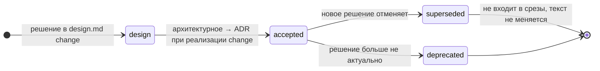
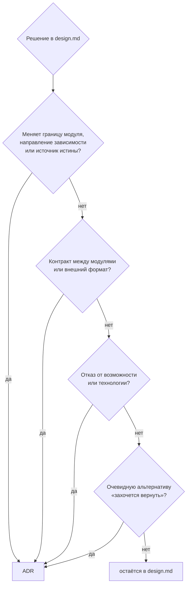

# 09. ADR: решения как закон для агентов

[← 08 — мультиагентная разработка](08-multi-agent.md) · [оглавление](README.md) · дальше: [10 — внедрение](10-adoption.md)

## Зачем ADR, когда работают агенты

Человек помнит, почему не взяли Kafka; агент каждой новой сессии — нет. Он
видит задачу, видит очевидное решение и предлагает его — часто то самое,
от которого уже отказались. ADR закрывает это: решение, причина и
**отвергнутая альтернатива** записаны и подшиваются в срез именно тем
модулям и доменам, которых касаются.

| Без ADR | С ADR в срезе |
| --- | --- |
| агент переоткрывает решённый вопрос | агент видит «рассмотрено и отвергнуто, потому что…» |
| два агента решают одно по-разному | у обоих в срезе один и тот же закон |
| ревьюер спорит со вкусом исполнителя | ревьюер ссылается на ADR |
| решение живёт в чате PR и теряется | решение — файл в git, со статусом и датой |

## Привязка к графу

ADR — третий слой графа. Поля `modules` и `domains` решают, в какие срезы он
попадёт:

```yaml
---
status: accepted
date: 2026-09-24
modules: [server, vscode, check]
domains: [ide-runtime, vscode-extension]
---
# ADR-002: Бэкенд в процессе расширения через inject() Fastify
```

- В срез модуля входят действующие ADR, ссылающиеся на его модули
  (с зависимостями); в срез домена — ADR, ссылающиеся на домен.
- **Узкая привязка — как и у `depends_on`.** ADR «про всё» попадает в
  каждый срез и перестаёт работать как сигнал. Решение, касающееся всего
  проекта, — повод для общего контекста, а не для ADR с пятью модулями.
- Модуль из ADR, который не описан, — ошибка проверки карты.

## Жизненный цикл



- **Источник — design.md.** Решение принимается в design change (решение +
  альтернатива); архитектурное поднимается в ADR — коротко, со ссылкой на
  design.md, где подробности.
- **Отменённое не переписывается.** У старого — `status: superseded` и
  `superseded_by`, у нового — ссылка на старый. История остаётся в git и в
  файле; недействующий ADR не попадает в срезы, но его можно выбрать явно.
- **Пример цепочки** — Применяется: ADR-005 «Агент запускается из IDE» →
  ADR-006 «IDE готовит контекст, а не запускает агентов». Отменённое
  решение ценно: оно объясняет, почему в IDE нет запуска агента, и не даёт
  его вернуть «по ошибке».

## Когда писать ADR



Примеры из репозитория:

| Решение | Триггер |
| --- | --- |
| ADR-001: расширение VS Code вместо отдельной web-IDE | граница продукта, отказ от бинаря |
| ADR-002: бэкенд через `inject()` без порта | контракт панель ↔ бэкенд, CI использует тот же |
| ADR-003: источник истины — файлы и CLI | источник истины |
| ADR-004: чистый `core` без Node API | направление зависимостей, правило проверяется тестом |
| ADR-006: контекст вместо агентов | отказ от возможности |

## Форма

```markdown
---
status: accepted          # accepted | superseded (+ superseded_by) | deprecated
date: YYYY-MM-DD
modules: [..]             # только существующие
domains: [..]             # только существующие
---

# ADR-NNN: <решение одной фразой>

## Контекст
Какая проблема, какие ограничения. 2–4 предложения.

## Решение
Что решили. Конкретно: имена модулей, функций, форматов.

## Рассмотренная альтернатива
Минимум одна — и почему отказались.

## Последствия
Что стало проще, что дороже, что теперь нельзя. Ссылка на design.md change.
```

Объём — 200–600 токенов: ADR — закон, а не история; история — в design.md.

## ADR и агенты

- **Агент пишет ADR по промпту** — Применяется: навык `context-fill`,
  промпт 3, источник — design.md change. Человек ревьюит обязательно:
  ADR — это решение команды, а не агента.
- **Ревьюер ссылается на ADR** — Идея (часть роли ревьюера в
  [08](08-multi-agent.md#роли)): замечание «нарушает ADR-004» проверяемо,
  «мне кажется, лучше иначе» — нет.
- **Агент, нашедший противоречие с ADR, останавливается** — Идея как
  правило для промптов: не обходит решение в коде, а предлагает новый ADR
  через `/opsx:update`.

## Идеи

| Идея | Суть |
| --- | --- |
| **ADR со статусом `proposed` внутри change** | ADR заводится в change вместе с design и становится `accepted` при архивации; ревью решения — часть ревью плана |
| **Проверка «решение без ADR»** | сведение, если в design.md решение помечено архитектурным, а ADR со ссылкой на этот change нет |
| **Индекс ADR по модулям** | автоматическая таблица «модуль → действующие ADR» в разделе «Контекст» уже есть в карточке узла; экспорт в markdown для людей |
| **Проверка ADR тестом** | у ADR-004 правило проверяет `purity.test.ts`; указывать в ADR, *чем* проверяется решение, — поле `enforced_by` |
| **Срок пересмотра** | поле `review_by` у решений, принятых «на время»; сведение, когда срок прошёл |
