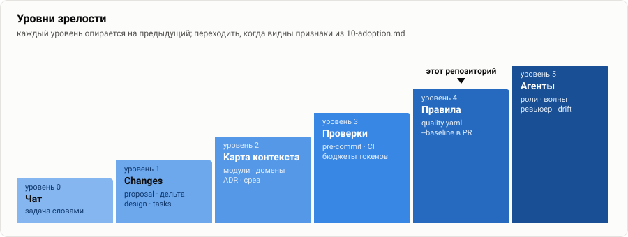
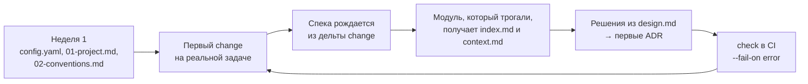

# 10. Внедрение

[← 09 — ADR](09-adr.md) · [оглавление](README.md) · дальше: [11 — антипаттерны](11-anti-patterns.md)

## Уровни зрелости

| Уровень | Что есть | Что даёт | Признак перехода на следующий |
| --- | --- | --- | --- |
| **0. Чат** | агент получает задачу словами, читает что найдёт | быстро на мелочах | одна и та же ошибка агента повторяется |
| **1. Changes** | `config.yaml` с правилами артефактов; каждая заметная задача — change: proposal, дельта, design, tasks | ревью плана до кода; требования в спеках | спек больше, чем помещается в голову |
| **2. Карта контекста** | общий контекст; модули с `domains`, `code_paths`, `depends_on`; первые ADR | срез вместо репозитория | контекст начинает расходиться с кодом |
| **3. Проверки** | `openspec-ide-check` в pre-commit и CI; `structure.yaml`; бюджеты `max_tokens` | сломанный контекст ломает PR | проверки стабильно зелёные |
| **4. Исполняемые правила** | `quality.yaml`: правила артефактов, пороги; `--baseline` в PR; `coverage`, `plan-test-ref` | договорённости не зависят от памяти агента | план стабильно делится на волны по модулям |
| **5. Несколько агентов** | роли, волны, ревьюер со свежим срезом, хранитель контекста, `drift` в CI | параллельность и независимая проверка | — |

Этот репозиторий — на уровне 4: проверки и исполняемые правила работают,
мультиагентные паттерны — следующий шаг ([08](08-multi-agent.md)).

## Существующий проект (brownfield)

Главное правило: **не описывать всё сразу.** Спеки и контекст появляются там,
где идёт работа.

- **Спеки — из changes, а не из археологии.** Первая дельта capability —
  `ADDED Requirements` на то, что меняется сейчас; остальное поведение
  описывается, когда до него дойдёт работа.
- **Модуль описывается, когда его меняют.** Навык `context-fill`, промпт 2;
  на первом проходе — `index.md` со связями и короткий `context.md`.
- **Домен без модулей и модуль без контекста — нормальное начальное
  состояние.** Предупреждения — это бэклог, а не провал.
- **Порог CI растёт с зрелостью**: сначала `--fail-on error`, затем
  предупреждения по `structure` и `context`, затем `--baseline` для качества
  спеков в PR.

## Новый проект (greenfield)

- `structure.yaml` с первого дня — раскладка закреплена до того, как
  появятся исключения.
- Модули — по пакетам или сервисам, `code_paths` — сразу.
- Первый change планирует каркас; ADR — на выбор стека и границы модулей.

## Роли в команде

| Роль | Ответственность |
| --- | --- |
| **Владелец процесса** | `config.yaml`, `quality.yaml`, пороги CI, навыки и промпты |
| **Владельцы модулей** | `index.md` и `context.md` своих модулей, ревью связей |
| **Архитектор** | ADR, ревью design.md, границы модулей и доменов |
| **Каждый разработчик** | change на свою задачу, ревью плана коллег, контекст — часть DoD |

## Метрики внедрения

Всё ниже IDE уже считает — их не надо собирать вручную.

| Метрика | Где смотреть | Ориентир |
| --- | --- | --- |
| домены без модулей | раздел «Контекст» → матрица | 0 для доменов, которые меняются |
| срезы в бюджете | «Контроль» → наборы модулей | все ≤ `max_tokens` |
| доля полезных токенов | «Контроль» → полезность | растёт или стабильна |
| отставание контекста | сведения `stale-context` | нет модулей с N ≥ 10 |
| покрытие сценариев планом | «Трассировка», проверка `coverage` | 100 % для ADDED/MODIFIED |
| забытые changes | доска, «ждёт архивации N дн.» | 0 старше недели |
| пересечения changes | «Пересечения», проверка `drift` | 0 незамеченных |
| метрики качества спеков | раздел «Качество», `--baseline` | не хуже целевой ветки |

## Чек-лист первых двух недель

- [ ] `openspec/config.yaml`: контекст проекта, правила артефактов (язык,
      SHALL, WHEN/THEN, альтернатива в design, метрика приёмки в tasks)
- [ ] `openspec/context/01-project.md`, `02-conventions.md` — навык
      `context-fill`, промпт 1
- [ ] первый change на реальной задаче: `/opsx:propose` → ревью плана →
      `/opsx:apply` → `/opsx:archive`
- [ ] `index.md` и `context.md` для модулей, которые трогал первый change
- [ ] первые ADR из design.md первого change
- [ ] `openspec/structure.yaml`
- [ ] `openspec-ide-check --only structure,context,authoring` в pre-commit
- [ ] `openspec-ide-check --format github` в CI
- [ ] договорённость в команде: контекст и архивация — часть DoD

## Что продавать команде

- **Ревью плана вместо ревью «стены кода».** Коммит `docs(openspec)` —
  десятки строк, которые читаются за минуты.
- **Агент перестаёт переоткрывать решённое** — ADR и «Альтернатива» в его
  срезе.
- **Контекст в 5–35 раз меньше**, и он проверен, а не «как получилось».
- **Новый человек входит так же, как агент**: общий контекст, срез модуля,
  ADR.
- **Ничего не надо разворачивать**: файлы в git, CLI, расширение VS Code и
  одна команда в CI.
