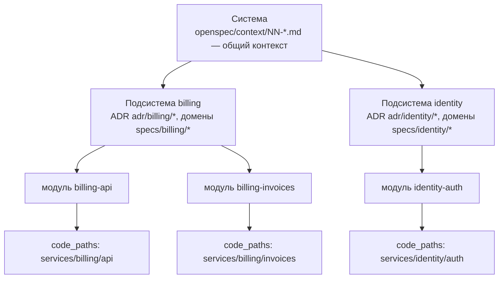
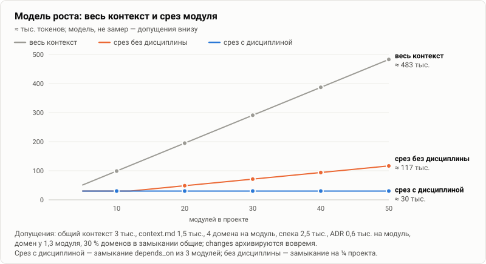

# 12. Большой модульный проект: модель и масштабирование

[← 11 — антипаттерны](11-anti-patterns.md) · [оглавление](README.md) · дальше: [13 — декомпозиция](13-decomposition.md)

Документы 01–11 описывают подход на этом репозитории: 5 модулей, 11 спеков.
Здесь — как он ведёт себя, когда модулей десятки, а capabilities сотни, и
какие правила надо заложить в архитектуру контекста заранее.

## Уровни

В большом проекте между «системой» и «модулем» появляются подсистемы —
ограниченные контексты в смысле DDD, команды, группы сервисов. Удобно
думать об уровнях как в модели C4:



| Уровень | Что описывает | Как выразить сейчас | Что попадает в срез |
| --- | --- | --- | --- |
| **Система** | продукт, источник истины, устройство верхнего уровня, термины, договорённости | `openspec/context/NN-*.md` | всегда, в каждый срез |
| **Подсистема** | границы ограниченного контекста, общие решения группы модулей | вложенные домены `specs/<подсистема>/<capability>/`, ADR в `adr/<подсистема>/`, префикс имени модуля `<подсистема>-<модуль>` | ADR — через `modules`/`domains`; спеки — через `domains` модулей |
| **Модуль** | устройство, контракты, инварианты одного пакета или сервиса | `modules/<модуль>/index.md` + `context.md` | свой и транзитивно `depends_on` |
| **Код** | реализация | `code_paths`, в том числе шаблоны (`services/*/src`) | не входит; проверяется путями и отставанием |

Что IDE поддерживает уже сейчас, а что — нет:

- **Применяется**: домены вкладываются на любую глубину
  (`specs/billing/invoices/spec.md` → домен `billing/invoices`); ADR
  читаются из подпапок `adr/` рекурсивно; `code_paths` принимают шаблоны
  (проверяется часть до первого `*` или `...`).
- **Ограничение**: модули — плоский список папок `modules/<папка>/`, общий
  контекст — только файлы верхнего уровня `openspec/context/*.md`.
  Подсистему для модулей выражают префиксом имени.
- **Идея**: общий контекст подсистемы (`context/subsystems/<имя>.md`),
  который входит в срезы только её модулей. Сейчас его роль играет
  ADR подсистемы или раздел «Границы» в `context.md` её модулей.

## Модель роста

Пусть в проекте `N` модулей, у модуля в среднем `k` доменов, спека весит `s`
токенов, `context.md` — `c`, общий контекст — `G`, а на модуль приходится
`a` токенов действующих ADR. Тогда, если changes архивируются вовремя:

```
весь контекст ≈ G + N·c + C·s + N·a        где C ≈ N·k / (модулей на домен)
срез модуля   ≈ G + |M*|·c + U(M*)·s + |M*|·a
```

`|M*|` — размер транзитивного замыкания по `depends_on`, `U(M*)` — число
*разных* доменов у модулей замыкания. **Весь контекст растёт линейно с `N`.
Срез от `N` не зависит — он зависит только от `|M*|` и `k`.** Отсюда главное
правило архитектуры: держать `|M*|` и `k` ограниченными, тогда проект может
расти сколько угодно.



Расчёт (это модель, не замер) при `G` = 3 тыс., `c` = 1,5 тыс., `k` = 4,
`s` = 2,5 тыс., `a` = 0,6 тыс., домен в среднем у 1,3 модуля, 30 % доменов
в замыкании общие:

| Модулей | Весь контекст | Срез: замыкание 3 модуля | Срез: замыкание ¼ проекта |
| --: | --: | --: | --: |
| 10 | ≈ 99 тыс. | ≈ 30 тыс. | ≈ 30 тыс. |
| 20 | ≈ 195 тыс. | ≈ 30 тыс. | ≈ 49 тыс. |
| 50 | ≈ 483 тыс. | ≈ 30 тыс. | ≈ 117 тыс. |
| 100 | ≈ 963 тыс. | ≈ 30 тыс. | ≈ 231 тыс. |

Правый столбец — что бывает, когда `depends_on` пишут «со всеми, с кем
общается»: замыкание растёт вместе с проектом, и срез перестаёт быть
срезом.

На этом репозитории (`N` = 5) контекст, спеки и настройки без активных
changes и README — ≈ 35 тыс., срезы модулей — 18–29 тыс.
([03](03-slicing.md#замер-на-этом-репозитории)): при пяти модулях срез ещё
сопоставим со всем контекстом. Выигрыш среза появляется с ростом `N` — и
именно поэтому правила связей надо закладывать до того, как проект вырос.

## Рычаги объёма среза

| Рычаг | Как влияет | Что сделать |
| --- | --- | --- |
| **размер замыкания `|M*|`** | линейно умножает контекст модулей, спеки и ADR | `depends_on` — только «без чего нельзя менять»; модуль-контракт вместо полного модуля ([14](14-contracts.md)) |
| **доменов у модуля `k`** | линейно умножает спеки | домен — только по коду; дробить capabilities ([13](13-decomposition.md)) |
| **вес спеки `s`** | спеки — 81–84 % среза в этом репозитории | спека > 5 тыс. — кандидат на разделение capability |
| **общий контекст `G`** | входит в каждый срез без исключения | бюджет общего контекста — жёсткий: ≤ 3 тыс. |
| **ADR на модуль `a`** | узкая привязка — мало, ADR «про всё» — в каждом срезе | `modules`/`domains` ADR — точечно |
| **незаархивированные changes** | в этом репозитории — 62 % всего объёма | архивировать вовремя ([06](06-change-lifecycle.md#архивируй-вовремя)) |
| **язык текста** | по оценке IDE на этом репозитории английский был бы дешевле на ≈ 27 % (9,2 тыс. из 33,4 тыс. по 23 файлам); зависит от токенизатора | решение уровня проекта ([17](17-architecture-template.md#решения-которые-надо-принять)) |

## Бюджеты по уровням

Стартовые значения — подстроить по замеру своего проекта:

| Что | Бюджет | Почему так |
| --- | --- | --- |
| общий контекст (все `NN-*.md`) | ≤ 3 тыс. | входит в каждый срез |
| `context.md` модуля | 600–2000, предел 3 тыс. | больше — модуль пора делить или выносить контракт |
| спека capability | ≤ 5 тыс. | больше — делить capability |
| ADR | 200–600 | закон, а не история |
| срез модуля (`max_tokens`) | текущий объём + 25 %, ориентир ≤ 40 тыс. | оставляет окну место для change, кода и рассуждений |
| срез для вопроса (домен) | ≤ 8 тыс. | спека + ADR + общий контекст |

## Ограничения графа

**Идея**: записать в архитектуре как правила (часть проверяется уже сейчас,
часть — ревью):

| Правило | Ориентир | Чем проверяется |
| --- | --- | --- |
| прямых `depends_on` у модуля | ≤ 3–4 | ревью; косвенно — `max_tokens` |
| глубина замыкания | ≤ 2–3 уровня | ревью; косвенно — `max_tokens` |
| доменов у модуля | ≤ 6–8 | ревью; косвенно — `max_tokens` |
| модулей у домена | ≤ 3–4 (больше — сквозная capability, см. [13](13-decomposition.md#формы-матрицы)) | матрица раздела «Контекст» |
| циклы `depends_on` | 0 | ошибка карты — Применяется |
| домены без модулей | 0 среди меняющихся | предупреждение — Применяется |
| `depends_on` через границу подсистемы | только на модуль-контракт | ревью |

## Срезы по типам задач

| Задача | Срез | Ориентир |
| --- | --- | --- |
| вопрос «как устроено X» | домен X: спека + ADR + общий контекст | ≤ 8 тыс. |
| правка внутри модуля | срез модуля + свой change | ≤ `max_tokens` + 6–10 тыс. |
| сквозная фича через подсистему | по группе плана — срез модуля группы; оркестратору — план и отчёты | каждый агент ≤ `max_tokens` ([08](08-multi-agent.md)) |
| изменение контракта | модуль-контракт + все модули, перечисляющие его в `depends_on` (для оценки влияния) — только контракты, без внутренностей | по числу потребителей |
| ревью | дифф + спеки затронутых доменов + ADR + план | ≤ 20 тыс. |
| архитектурное решение | срезы доменов затронутых подсистем + все действующие ADR подсистем | ≤ 30 тыс. |

## Что сделать на старте большого проекта

1. Замерить: раздел «Контекст» → «Контроль» показывает объём каждого файла
   и каждого набора. Записать цифры в архитектурный документ.
2. Выбрать уровни и правило имён: подсистемы, префиксы модулей, вложенность
   доменов.
3. Утвердить бюджеты и ограничения графа (таблицы выше).
4. Описать модули-контракты для границ подсистем ([14](14-contracts.md)).
5. Закрепить раскладку в `structure.yaml`, включая подпапки `adr/` и
   вложенные `specs/`.
6. Включить проверки в CI ([16](16-context-operations.md#ci-в-большом-репозитории)).
