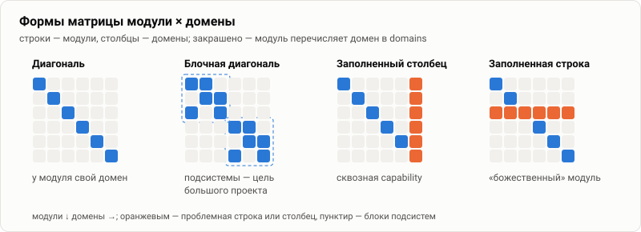

# 13. Декомпозиция: как резать модули и домены

[← 12 — большой проект](12-large-project.md) · [оглавление](README.md) · дальше: [14 — контракты](14-contracts.md)

Граф работает, только если узлы нарезаны правильно: модуль — единица
изменения и владения, домен — единица поведения. Ошибка нарезки не видна в
маленьком проекте и становится главной причиной раздутых срезов в большом.

## Модуль

**Модуль — то, что меняют, собирают и за что отвечают как за целое.**

| Признак | Хороший модуль | Плохой модуль |
| --- | --- | --- |
| код | свои `code_paths`, не пересекаются с соседями | общий каталог с другим модулем |
| сборка и поставка | отдельный пакет, сервис или библиотека | «половина пакета» |
| владелец | одна команда | «все понемногу» |
| контракт | понятно, что он отдаёт наружу | наружу торчит всё |
| `context.md` | 600–2000 токенов | больше 3 тыс. — внутри несколько модулей |
| `depends_on` | 0–4 прямых | «со всеми» |

Когда делить модуль:

- `context.md` не укладывается в 2–3 тыс. токенов без потери смысла;
- у модуля больше 6–8 доменов;
- части модуля меняют разные команды или в разном темпе;
- потребители зависят только от части — это повод выделить модуль-контракт
  ([14](14-contracts.md)).

Когда объединять: два модуля всегда меняются вместе, а их `context.md`
ссылаются друг на друга в каждом абзаце.

## Домен (capability)

**Домен — связная группа требований с общими участниками и целями, которую
можно проверить сценариями независимо от других.**

| Признак | Хороший домен | Плохой домен |
| --- | --- | --- |
| название | существительное предметной области: `billing/invoices` | имя пакета или слоя: `backend`, `ui` |
| требования | одна семья целей одного участника | «всё про сервис X» |
| сценарии | проверяются на одних фикстурах | тянут половину системы |
| размер | ≤ 5 тыс. токенов | больше — его тащит каждый срез |
| модулей | 1–3 | у каждого второго модуля — сквозная capability |

Вложенность — **Применяется**: `specs/billing/invoices/spec.md` и
`specs/billing/payments/spec.md` — два домена подсистемы `billing`; модуль
перечисляет только тот, что реализует.

Делить capability — через change: дельта `REMOVED`/`RENAMED` в старом спеке,
`ADDED` в новых. Урезать спеку вручную, чтобы влезть в бюджет, нельзя: это
потеря требований.

## Формы матрицы

| Форма | Что значит | Что делать |
| --- | --- | --- |
| **диагональ** | у каждого модуля свой домен | идеал для маленьких проектов; в большом бывает редко |
| **блочная диагональ** | подсистемы: модули подсистемы делят её домены, между блоками — пусто | цель для большого проекта; блок = ограниченный контекст |
| **заполненный столбец** | один домен у многих модулей — сквозная capability (авторизация, аудит, i18n) | делить capability по участникам или вынести в модуль-платформу с контрактом |
| **заполненная строка** | один модуль со многими доменами — «божественный» модуль | делить модуль по доменам или по слоям с модулем-контрактом |
| **пустая строка** | модуль без доменов | нормально для инфраструктуры (`check` здесь); иначе — пропущены связи |
| **пустой столбец** | домен без модулей | предупреждение IDE: связь пропущена или спека устарела |

Матрицу смотреть в разделе «Контекст» → «Матрица»: число модулей у каждого
домена видно сразу.

## Связь с DDD

| DDD | Граф контекста |
| --- | --- |
| ограниченный контекст (bounded context) | подсистема: префикс модулей, папка доменов `specs/<подсистема>/`, папка ADR `adr/<подсистема>/` |
| единый язык (ubiquitous language) | термины в общем контексте — только общесистемные; термины подсистемы — в её ADR или `context.md` модулей |
| карта контекстов (context map) | `depends_on` между модулями разных подсистем — только через модули-контракты |
| агрегат, сценарий использования | capability или её требование |
| антикоррупционный слой | отдельный модуль-адаптер со своим `context.md` и `depends_on` на модуль-контракт чужой подсистемы |

## Сквозные аспекты

Логирование, авторизация, локализация, телеметрия касаются всех модулей.
Три варианта, от лучшего к худшему:

1. **Договорённость в общем контексте** — если правило короткое и одно для
   всех: «пользовательские строки — через словарь», «ошибки — с файлом и
   строкой». Стоит токенов в каждом срезе, поэтому только коротко.
2. **Модуль-платформа с контрактом** — если у аспекта есть код и API:
   модули, которые его *меняют*, перечисляют его в `depends_on`; модули,
   которые им только *пользуются*, — нет, им хватает договорённости.
3. **`depends_on` на платформу у всех модулей** — антипаттерн: платформа
   попадает в каждый срез вместе со своими доменами.

## Общие библиотеки

Библиотека, которой пользуются многие, — модуль с коротким `context.md`,
построенным вокруг контракта: что экспортирует, какие инварианты гарантирует,
как расширять. Её внутренности — в отдельном разделе в конце или в
отдельном модуле-реализации. Так её потребители получают в срез контракт, а
не устройство.

## Чек-лист нарезки

- [ ] у каждого модуля свои `code_paths`, без пересечений
- [ ] у каждого модуля один владелец
- [ ] `context.md` каждого модуля ≤ 3 тыс. токенов
- [ ] домены названы по предметной области, а не по слоям
- [ ] каждая спека ≤ 5 тыс. токенов
- [ ] матрица — блочная диагональ; заполненные столбцы и строки объяснены
- [ ] сквозные аспекты — договорённостью или модулем-платформой
- [ ] связи между подсистемами — только через модули-контракты
