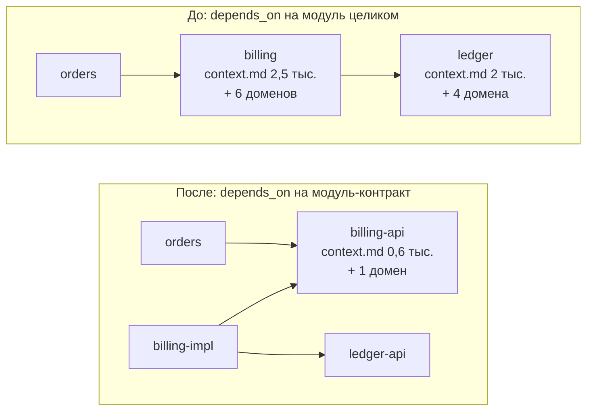
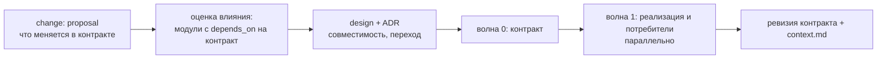

# 14. Контракт вместо контекста

[← 13 — декомпозиция](13-decomposition.md) · [оглавление](README.md) · дальше: [15 — несколько репозиториев](15-polyrepo.md)

## Проблема

Срез включает `context.md` каждого модуля транзитивного замыкания по
`depends_on` — целиком, вместе с доменами. Модулю-потребителю из чужого
модуля нужно немного: *что* он отдаёт и *какие гарантии* даёт. Устройство,
подводные камни и «как менять» чужого модуля в срезе потребителя — балласт,
а домены поставщика тянут его спеки.



Пример условный: у потребителя `orders` в срезе вместо двух полных модулей
и десяти спек — один короткий контракт и одна спека.

## Модуль-контракт — работает уже сейчас

Ничего не нужно менять в IDE: модуль-контракт — обычный модуль.

```yaml
# openspec/context/modules/billing-api/index.md
---
module: billing-api
description: Публичный контракт подсистемы billing — API счетов и события оплаты
domains: [billing/invoices-api]
code_paths: [services/billing/api, contracts/billing]
depends_on: []
max_tokens: 8000
---
```

```yaml
# openspec/context/modules/billing-impl/index.md
---
module: billing-impl
description: Реализация billing — расчёт, хранение, интеграция с ledger
domains: [billing/invoices, billing/payments]
code_paths: [services/billing/core]
depends_on: [billing-api, ledger-api]
max_tokens: 30000
---
```

- Потребители перечисляют в `depends_on` только `billing-api`.
- `billing-impl` зависит от своего контракта: меняя реализацию, агент видит,
  что обещано наружу.
- Фикстура IDE использует тот же приём: `code_paths: [sds-master/src/main/java, sds-master-api]`
  — код API лежит отдельно от реализации.

## Что писать в `context.md` модуля-контракта

| Раздел | Что | Чего не писать |
| --- | --- | --- |
| **Что отдаёт** | маршруты, типы, события, команды — ссылкой на файл схемы (`contracts/billing/openapi.yaml`) | копию схемы: IDE отметит большой блок кода |
| **Гарантии** | идемпотентность, порядок событий, сроки, коды ошибок | устройство реализации |
| **Версионирование** | как меняется контракт, что считается несовместимым | историю версий |
| **Как пользоваться** | 2–3 типичных вызова словами, со ссылкой на тест-пример | листинги кода |
| **Владелец и ADR** | кто меняет контракт, какие ADR действуют | — |

Ориентир — 400–800 токенов. Ссылки на схемы и тесты проверяются: путь,
которого нет, — предупреждение.

## Изменение контракта

Изменение контракта — всегда отдельный change и почти всегда ADR, если оно
несовместимое.



- **Оценка влияния** — **Применяется**: карточка модуля в разделе «Контекст»
  показывает зависимые модули — список потребителей контракта.
- **Ревизия контракта** — **Применяется** в этом репозитории:
  `API_REVISION` в `packages/core/src/constants.ts` поднимается при каждом
  новом поле или маршруте, панель сверяет её с бэкендом. В большом проекте
  — версия в схеме контракта и правило совместимости в ADR.
- **Волна 0 — контракт** ([08](08-multi-agent.md#волны-из-графа)): пока
  контракт не согласован и не зелёный, потребители не начинают.

## Идеи развития IDE

| Идея | Суть |
| --- | --- |
| **режим зависимости** | `depends_on: [{ module: billing, mode: contract }]` — в срез идёт только раздел «Контракты» `context.md` поставщика, без его доменов |
| **поле `contracts`** | `contracts: [contracts/billing/openapi.yaml]` в `index.md`; файлы контракта подшиваются в срезы потребителей и проверяются на существование |
| **граница подсистемы** | замечание, если `depends_on` ведёт в модуль другой подсистемы, не помеченный как контракт |
| **потребители в отчёте change** | change, затрагивающий `code_paths` модуля-контракта, получает в карточке список потребителей |
