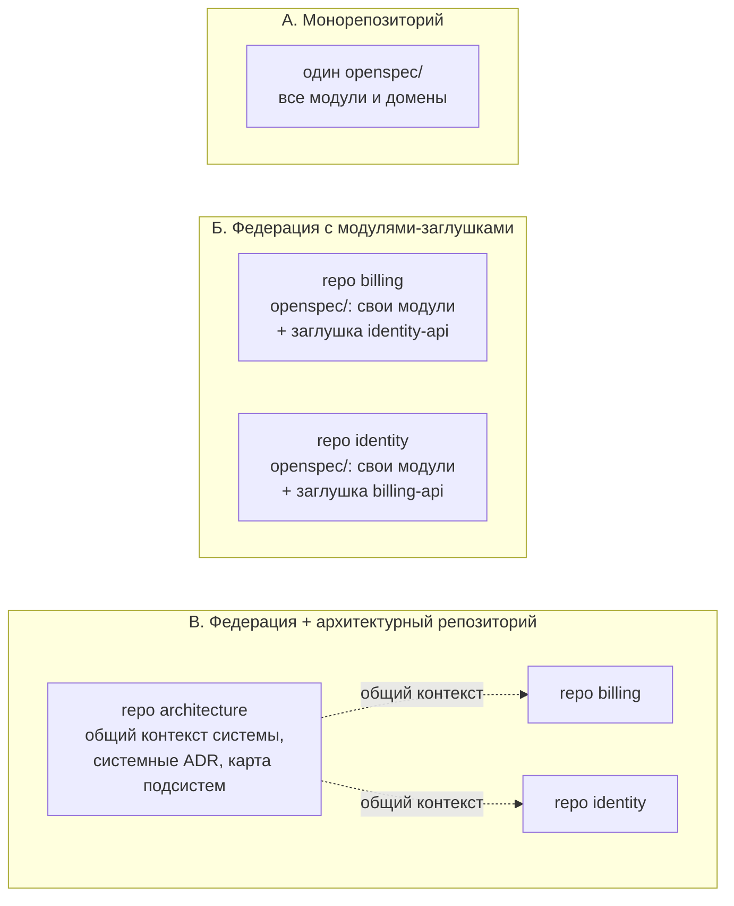
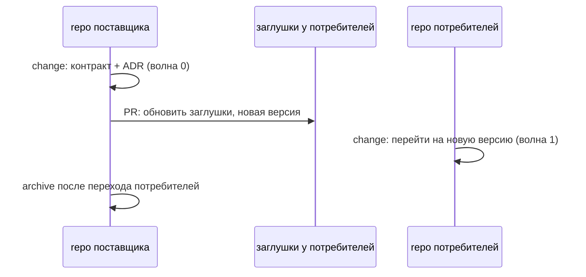

# 15. Несколько репозиториев

[← 14 — контракты](14-contracts.md) · [оглавление](README.md) · дальше: [16 — эксплуатация](16-context-operations.md)

Модульный проект часто живёт не в одном репозитории. Карта контекста
OpenSpec IDE строится по одному корню — `openspec/` репозитория, — поэтому
связи между репозиториями нужно спроектировать явно.

## Варианты



| Вариант | Плюсы | Минусы | Когда |
| --- | --- | --- | --- |
| **А. Монорепозиторий** | один граф, все проверки видят всё, сквозной change — один PR | большой `openspec/`, нужна дисциплина подсистем | код и так в монорепозитории |
| **Б. Федерация с заглушками** | каждая команда владеет своим `openspec/`; работает без доработок IDE | заглушки надо синхронизировать; сквозной change — несколько PR | независимые команды, редкие сквозные изменения |
| **В. Федерация + архитектурный репозиторий** | системный контекст и ADR в одном месте; команды автономны | ещё один репозиторий; общий контекст надо доставлять в каждый | много репозиториев, сильная архитектурная функция |

## Модуль-заглушка — работает уже сейчас

Внешний модуль описывается в репозитории-потребителе как обычный модуль без
`code_paths`:

```yaml
# repo billing: openspec/context/modules/identity-api/index.md
---
module: identity-api
description: Внешний контракт подсистемы identity (репозиторий identity) — токены, профили
domains: []
depends_on: []
max_tokens: 3000
---
```

`context.md` заглушки — раздел «Что отдаёт» и «Гарантии» модуля-контракта
([14](14-contracts.md#что-писать-в-contextmd-модуля-контракта)) и ссылка на
источник: репозиторий, путь к схеме, версия.

Как IDE это видит:

- модули репозитория могут указывать `identity-api` в `depends_on` — ошибки
  «модуль не описан» нет;
- у заглушки нет `code_paths` — **сведение**, а не ошибка: это ожидаемо;
- отставание от кода не считается — свежесть заглушки надо обеспечить
  процессом.

Правила заглушек:

- **Владелец заглушки — команда-поставщик.** Она обновляет заглушки в
  репозиториях-потребителях PR-ом при изменении контракта.
- **Только контракт.** Внутренности чужого модуля и его спеки в заглушку не
  копируются.
- **Версия в тексте.** «Соответствует контракту identity v3 (тег
  `identity-api/v3.2`)» — по ней видно, что заглушка устарела.

## Общий контекст в федерации

| Способ | Как | Риск |
| --- | --- | --- |
| копия в каждом репозитории | `openspec/context/01-system.md` одинаковый везде, обновляется PR-ами из архитектурного репозитория | расхождение копий |
| подмодуль git | `openspec/context/system/` — подмодуль; **Ограничение**: общий контекст IDE читает только из файлов верхнего уровня `openspec/context/*.md`, поэтому подмодуль подойдёт для ADR (`adr/system/` читается рекурсивно), а для общего контекста нужен файл верхнего уровня | сложность git |
| генерация при сборке | **Идея**: CI архитектурного репозитория публикует общий контекст и заглушки контрактов, CI команды подтягивает их перед проверкой | инфраструктура |

## Проверки в федерации

- Каждый репозиторий: `openspec-ide-check` по своему корню (`--root` для
  нестандартной раскладки) — те же ворота, что в монорепозитории
  ([04](04-validation.md#ворота-где-ловится-ошибка)).
- Архитектурный репозиторий: проверка карты подсистем и системных ADR.
- **Идея**: проверка заглушек — версия в тексте заглушки сравнивается с
  последним тегом контракта поставщика; отставание — сведение.

## Сквозной change в федерации



- Change поставщика ссылается на changes потребителей в proposal («Impact»).
- Несовместимое изменение — ADR в архитектурном репозитории или в репозитории
  поставщика со ссылкой из заглушек.
