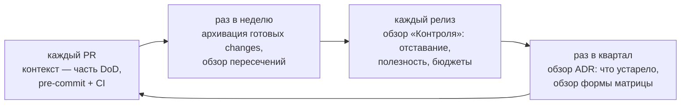
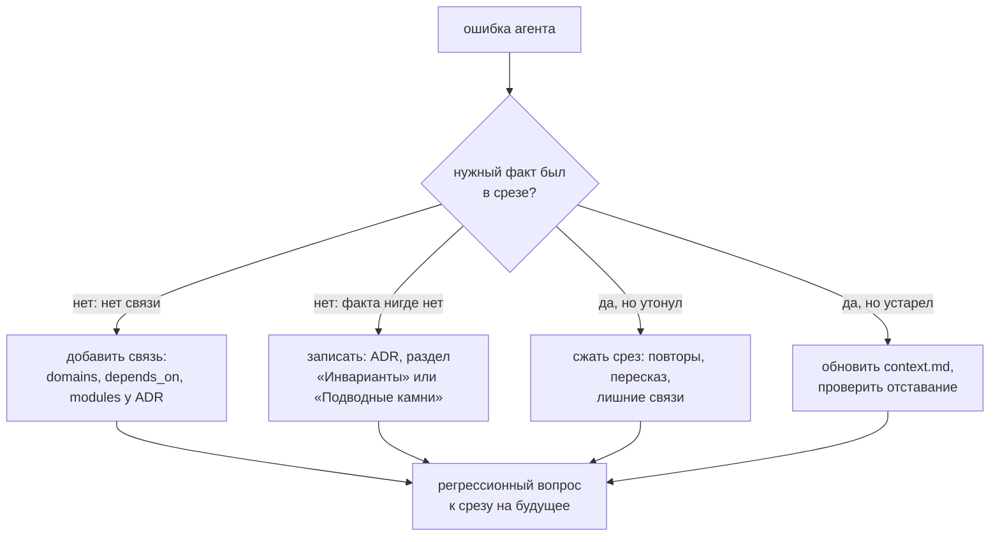

# 16. Эксплуатация контекста

[← 15 — несколько репозиториев](15-polyrepo.md) · [оглавление](README.md) · дальше: [17 — шаблон архитектурного документа](17-architecture-template.md)

Контекст — не документ, который пишут один раз, а система, которую
эксплуатируют: у неё есть владельцы, нормы свежести, ворота и разбор
инцидентов.

## Владение

Владелец модуля отвечает за его код *и* его контекст. Закрепить это проще
всего файлом владельцев репозитория — **Применяется** как механизм GitHub и
GitLab, не требует IDE:

```text
# .github/CODEOWNERS
/services/billing/                        @team-billing
/openspec/context/modules/billing-*/      @team-billing
/openspec/specs/billing/                  @team-billing @product-billing
/openspec/context/adr/billing/            @team-billing @arch
/openspec/context/*.md                    @arch
/openspec/structure.yaml                  @arch
/openspec/quality.yaml                    @arch
```

| Что | Кто утверждает изменения |
| --- | --- |
| `index.md` модуля (связи, бюджет) | владелец модуля; связи через границу подсистемы — ещё архитектор |
| `context.md` модуля | владелец модуля |
| спека домена | владелец домена и продукт |
| ADR | архитектор и владельцы модулей из `modules` |
| общий контекст, `structure.yaml`, `quality.yaml` | архитектор |

## Нормы свежести

| Показатель | Норма | Где видно |
| --- | --- | --- |
| отставание `context.md` от кода | < 10 коммитов в `code_paths` (свежесть ≥ 0,5) | сведение в «Контроле» и CI |
| забытые changes | 0 старше 7 дней в «Готово к архивации» | доска, «ждёт архивации N дн.» |
| срезы сверх бюджета | 0 | предупреждение в CI |
| домены без модулей | 0 среди меняющихся | предупреждение |
| доля полезных токенов | не падает от релиза к релизу | «Контроль» → полезность |
| пересечения changes | 0 незамеченных | «Пересечения», проверка `drift` |

## Ритм



## CI в большом репозитории

| Когда | Что запускать | Зачем |
| --- | --- | --- |
| pre-commit | `--only structure,context,authoring` | быстро, по файлам, без истории git |
| PR | все проверки, `--format github` | аннотации на строках PR |
| PR в main | `--only quality --baseline origin/main` | качество спеков не хуже целевой ветки |
| ночью | все проверки с `--fail-on warning` в отчёт, без блокировки | тренд предупреждений, отставание контекста |
| перед архивацией | `openspec validate <change> --strict` | формат по CLI |

Для `drift` нужна история: `fetch-depth: 0` в checkout.

**Идея** для очень больших репозиториев: проверять в PR только модули,
чьи `code_paths` или папки контекста затронуты диффом, и их зависимых;
полную проверку — ночью.

## Инцидент контекста

Агент сделал неверно, потому что не знал о решении, ограничении или
контракте. Исправить код мало — повторится. Разбор:



Регрессионный вопрос — **Идея** ([07](07-ai-patterns.md#e-идеи-для-развития)):
«какой модуль отвечает за X», «почему не Y», «что нельзя делать при Z» с
ожидаемым ответом. Набор таких вопросов прогоняют после крупной правки
контекста.

## Безопасность контекста

- **Никаких секретов**: ключей, токенов, паролей, внутренних адресов.
  Контекст уходит в модель вместе с промптом. Base64 и длинные hex-строки
  IDE уже отмечает как антипаттерн `opaque-blob` — это и защита.
- **Персональные данные** — только обезличенные примеры в сценариях и
  фикстурах.
- **Ссылка вместо копии** для чувствительных документов: агент откроет файл,
  если у него есть доступ, а в срез он не попадёт.

## Метрики для дашборда

| Метрика | Источник | Тренд, который нужен |
| --- | --- | --- |
| весь контекст, ≈ токены | «Контроль» | растёт медленнее числа модулей |
| медиана и максимум среза модуля | «Контроль» → наборы | стабильны |
| доля полезных токенов | «Контроль» → полезность | растёт |
| модулей с отставанием ≥ 10 коммитов | сведения `stale-context` | падает |
| активных changes и их объём | доска | не копится |
| покрытие сценариев планом | «Трассировка», `coverage` | 100 % для ADDED/MODIFIED |
