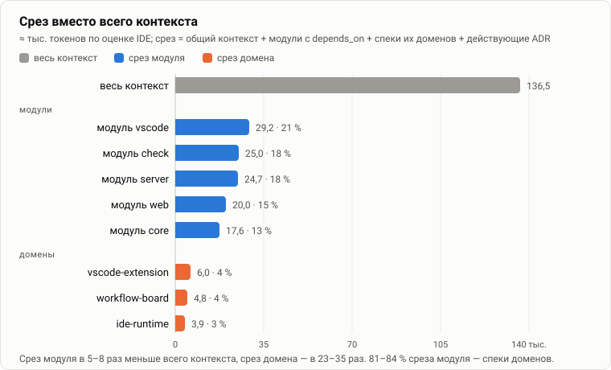
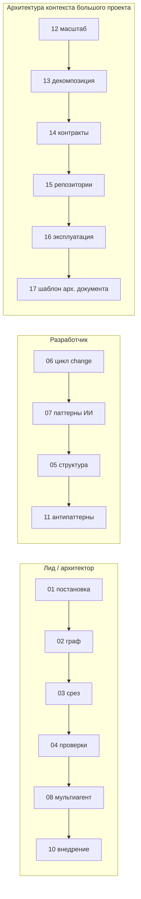

# Разработка с OpenSpec и ИИ: паттерны

Здесь собрано то, что сложилось при разработке OpenSpec IDE по самому
OpenSpec с ИИ-агентами, и то, что предлагается развивать дальше: зачем
проект вообще нужен, как устроен контекст для агентов, как его проверять, как
вести changes, как работать с одним агентом и с несколькими, как писать ADR и
как внедрять всё это в команде.

## Главное в одной картинке

Весь контекст проекта — общий контекст, контекст модулей, ADR, основные
спеки, активные changes, настройки и README — по оценке IDE занимает
**≈ 137 тыс. токенов**. Срез для работы над одним модулем — **18–29 тыс.**
(13–21 %), срез по одному домену — **4–6 тыс.** (3–4 %). Ради этого проект и
создавался: **подшивать агенту только нужную часть контекста и проверять, что
эта часть верна.** Цифры и способ подсчёта —
[03-slicing.md](03-slicing.md#замер-на-этом-репозитории).

## Документы

| Файл | О чём | Кому в первую очередь |
| --- | --- | --- |
| [01-problem.md](01-problem.md) | архитектурная постановка: проблема, цель, атрибуты качества, ограничения, не цели | архитектор, лид |
| [02-context-graph.md](02-context-graph.md) | контекст как граф «модули × домены × ADR», почему две оси, матрица этого репозитория | архитектор |
| [03-slicing.md](03-slicing.md) | как собирается срез, пример, замер, дисциплина связей и бюджеты | архитектор, разработчик |
| [04-validation.md](04-validation.md) | уровни проверки контекста, ворота в редакторе, pre-commit и CI | лид, DevOps |
| [05-file-structure.md](05-file-structure.md) | раскладка файлов, именование, форма артефактов | все |
| [06-change-lifecycle.md](06-change-lifecycle.md) | жизненный цикл change, серии changes, трассировка, архивация | разработчик |
| [07-ai-patterns.md](07-ai-patterns.md) | каталог паттернов работы с одним агентом | разработчик |
| [08-multi-agent.md](08-multi-agent.md) | мультиагентная разработка: роли, топологии, разделение работы, ворота | лид, архитектор |
| [09-adr.md](09-adr.md) | ADR как закон для агентов: когда писать, как привязывать, жизненный цикл | архитектор |
| [10-adoption.md](10-adoption.md) | внедрение: уровни зрелости, brownfield, метрики, план первых недель | лид, менеджер |
| [11-anti-patterns.md](11-anti-patterns.md) | антипаттерны: симптом, чем вредит, как ловится, как исправить | все |
| [12-large-project.md](12-large-project.md) | большой модульный проект: уровни, модель роста среза, рычаги объёма, бюджеты, ограничения графа, срезы по типам задач | архитектор |
| [13-decomposition.md](13-decomposition.md) | как резать модули и домены, формы матрицы, связь с DDD, сквозные аспекты | архитектор |
| [14-contracts.md](14-contracts.md) | контракт вместо контекста: модуль-контракт, что в нём писать, изменение контракта | архитектор, лид |
| [15-polyrepo.md](15-polyrepo.md) | несколько репозиториев: монорепо, федерация, модули-заглушки, сквозной change | архитектор |
| [16-context-operations.md](16-context-operations.md) | эксплуатация: владение, нормы свежести, ритм, CI в большом репозитории, инцидент контекста, безопасность | лид, DevOps |
| [17-architecture-template.md](17-architecture-template.md) | **шаблон архитектурного документа**: разделы с вопросами, решения D1–D12, интервью владельцев, критерии готовности | архитектор |

## Маршруты чтения

## Как помечены паттерны

- **Применяется** — уже работает в этом репозитории; рядом ссылка на файл,
  change или ADR, где это видно.
- **Идея** — предлагается для внедрения; в репозитории ещё нет или есть
  частично. Идея помечена явно, чтобы не выдавать желаемое за сделанное.

## Где нормативная часть

Этот каталог объясняет и предлагает; обязательные правила лежат рядом с
кодом и проверяются:
[`openspec/config.yaml`](../../openspec/config.yaml) (правила артефактов),
[`openspec/context/02-conventions.md`](../../openspec/context/02-conventions.md)
(договорённости), [`openspec/structure.yaml`](../../openspec/structure.yaml)
(раскладка), [`openspec/quality.yaml`](../../openspec/quality.yaml)
(исполняемые правила качества), разделы README «Контекст модулей» и «Контроль
контекста».

Каталог лежит в `docs/`, а не в `openspec/context/`, намеренно: он для людей
и не должен попадать в каждый срез агента.
